# ModSim Codex Handoff: Implementation Plan and UML Specification v0.3

**Project:** ModSim  
**Purpose:** A backend-agnostic framework for defining modular robot hardware, building robot packs from CAD-generated robot assets, managing modular-robot runtime state, generating mathematical model views, and coordinating simulator-backed execution with docking/undocking semantics.  
**Status:** Implementation handoff v0.3  
**Primary implementation focus:** Build the first working vertical slice around **robot-pack definition and hardware description using ModSim Studio**, a standalone desktop Python application built with **PySide6/Qt**, **PyVistaQt/PyVista**, and **PyQtGraph**. The workflow imports a CAD-generated URDF/meshes, visualizes and annotates hardware, connectors, docking interfaces, and constraints, saves a validated Robot Pack, previews mathematical model views, then runs a MuJoCo-backed runtime where ModSim manages state and MuJoCo manages physics.

---

## 0. Codex mission for v0.3

The previous design clarified that ModSim is **not a physics engine** and should not make graphs the canonical representation. This updated handoff changes the first implementation priority:

> Start with the workflow where a user defines a modular robot in ModSim.

The first implementation should prove this loop:

1. User starts with a **CAD-generated URDF and mesh folder**.
2. ModSim imports the URDF and creates a draft Robot Pack.
3. ModSim Studio opens as a **standalone desktop GUI** using PySide6/Qt with an embedded PyVistaQt 3D viewport for robot/module geometry, links, joints, frames, connector axes, and meshes.
4. User interactively annotates:
   - module type;
   - joints and actuator metadata;
   - connector/docking interfaces;
   - docking frames and approach axes;
   - acceptance regions;
   - connector compatibility;
   - hardware constraints;
   - backend mapping metadata.
5. ModSim validates the Robot Pack and saves YAML files.
6. ModSim generates mathematical model views from the Robot Pack:
   - hardware tree view;
   - kinematic/frame view;
   - port/connector view;
   - topology/graph view for current connections;
   - matrix view where applicable.
7. User launches a runtime session.
8. MuJoCo loads the URDF/MJCF asset and handles physics.
9. ModSim maintains semantic state: modules, connectors, connections, assemblies, events, metrics, generated model views.
10. ModSim Studio switches to a Runtime Inspector/Dashboard mode that shows modular-robot-specific model views, event timelines, connection state, assemblies, and metrics using Qt panels and PyQtGraph charts.

The initial scope should target **MuJoCo first** and keep Isaac Sim support as a later adapter. The core design must remain backend-agnostic.

---

## 1. Language decision

### ADR-LANG-001: Python-first, not Python-only

ModSim should be implemented as a **Python-first framework**.

Reasons:

- MuJoCo and Isaac Sim both expose Python workflows.
- ModSim is primarily a framework/orchestration layer, not a real-time physics engine.
- Robot-pack schemas, YAML validation, GUI tooling, import pipelines, state management, model-view generation, and algorithm plugins are all well suited to Python.
- Python lowers the contribution barrier for robotics researchers and students.
- C++ can be added later only where profiling proves the need.

### Coding style requirement

Although Python is dynamic, ModSim should be written like a strongly typed systems framework:

```text
- use type hints everywhere;
- prefer Pydantic models for validated configuration files;
- prefer dataclasses or Pydantic models for runtime state objects;
- use Enum classes for lifecycle and state-machine values;
- use Protocol / ABC interfaces for adapters and plugins;
- avoid unstructured dict-heavy core code;
- enforce formatting, linting, and type checking in CI.
```

### Future C++ path

Do not start with C++. Add optional native extensions later for:

```text
- large-scale connector-pair candidate detection;
- fast assembly-index updates;
- high-frequency docking guard evaluation;
- large graph/lattice algorithms;
- real-time hardware control loops;
- custom MuJoCo plugins;
- Isaac/OmniGraph nodes.
```

The public API should remain Python.

---

## 2. Recommended package stack

Keep the dependency model layered. The core should stay light. GUI, MuJoCo, Isaac, and advanced visualization should be optional extras.

### 2.1 Project and tooling

| Purpose | Recommended package/tool | Notes |
|---|---|---|
| Packaging | `pyproject.toml` | Use modern Python packaging. |
| Dependency manager | `uv` | Fast project setup and lockfiles. |
| Formatting/linting | `ruff` | Use for formatting and lint rules. |
| Type checking | `pyright` or `mypy` | Prefer `pyright` for speed and IDE compatibility. |
| Tests | `pytest`, `pytest-cov` | Required from the first commit. |
| Property tests | `hypothesis` | Useful for graph/state/serialization invariants. |
| Git hooks | `pre-commit` | Run ruff, type checker, tests where appropriate. |
| CLI | `typer`, `rich` | For `modsim pack init`, `modsim validate`, `modsim run`. |

### 2.2 Core framework

| Purpose | Recommended package | Notes |
|---|---|---|
| Validated schemas | `pydantic` v2 | Robot Pack, hardware specs, connector specs, capabilities. |
| YAML | `ruamel.yaml` | Better round-trip editing than basic PyYAML. |
| JSON export | `orjson` | Fast serialization for state snapshots/event logs. |
| Numerical arrays | `numpy` | Common representation for transforms, matrices, metrics. |
| Linear algebra / rotations | `scipy` | `scipy.spatial.transform.Rotation` for transforms. |
| Graph views | `networkx` | Good initial implementation for topology/port graphs. |
| Platform paths | `platformdirs` | Store app settings/cache cleanly. |

### 2.3 URDF, geometry, and mesh import

| Purpose | Recommended package | Notes |
|---|---|---|
| URDF parsing | `yourdfpy` first; evaluate `urdfpy` | Use for loading, validating, manipulating, and visualizing URDF assets. |
| XML fallback | `lxml` | Needed for robust custom URDF/Xacro metadata parsing. |
| Mesh loading | `trimesh` | Load STL/OBJ/DAE/GLTF and inspect bounds/transforms. |
| Mesh conversion | `meshio` or `trimesh` exporters | Optional. |
| CAD-native support | Not in MVP | CAD should generate URDF/meshes externally. |

### 2.4 GUI / ModSim Studio

Use a **standalone desktop Python GUI** for the first ModSim Studio implementation. Do **not** start with a web GUI and do **not** make the primary GUI an Isaac Sim extension. ModSim must remain backend-agnostic and usable before any simulator is launched.

**Required first-choice stack:**

| Purpose | Recommended package | Decision | Notes |
|---|---|---|---|
| Main GUI framework | `PySide6` | Required | Official Qt for Python binding. Use for main window, dock widgets, tree views, property editors, menus, dialogs, validation panels, and project management. |
| 3D robot-pack viewport | `pyvista` + `pyvistaqt` | Required for Studio MVP | Use for URDF/mesh visualization, link frames, joint axes, connector frames, docking axes, acceptance regions, and selection overlays. |
| Runtime plots/metrics | `pyqtgraph` | Required for Runtime Inspector MVP | Use for live metrics, event rates, docking attempts, latency, connector load estimates, and matrix visualizations. |
| Graph/model drawing | `networkx` + Qt/PyVista drawing first | Required initially | Start simple. Avoid adding heavy graph UI dependencies until model-view generation stabilizes. |
| GUI tests | `pytest-qt` | Add after shell stabilizes | Test non-rendering view models first; keep rendering tests minimal. |
| Icons/theme | `qtawesome` | Optional | Nice-to-have only. |

**Explicit non-goals for the initial GUI:**

```text
- no web GUI as the primary interface;
- no Electron/Tauri/React frontend;
- no Isaac Sim extension as the primary UI;
- no full CAD editor;
- no full physics/rendering engine inside ModSim Studio;
- no requirement to embed MuJoCo or Isaac viewers into Studio.
```

Studio should run in two modes that share widgets:

```text
Robot Pack Builder mode:
  import URDF/meshes, inspect links/joints/frames, annotate connectors and constraints, validate and save Robot Pack YAML.

Runtime Inspector mode:
  connect to a ModSim runtime session, display WorldState, ModelViews, assemblies, connections, docking events, backend status, and modular-robot metrics.
```

Important dependency boundary:

```text
modsim-core must not import PySide6, PyVista, PyQtGraph, MuJoCo, Isaac, or VTK.
modsim-studio may import GUI and visualization packages.
modsim-backend-mujoco may import mujoco.
```

### 2.5 Backend adapters

| Backend | Package | Implementation note |
|---|---|---|
| Mock backend | no external dependency | First backend. Used for tests and CI. |
| MuJoCo | `mujoco` | First real physics backend. Optional extra. |
| Isaac Sim | Isaac Python environment | Later. Do not force Isaac dependencies into normal Python env. |
| USD | `usd-core`, optional | Evaluate only when building Isaac/export tools. |

### 2.6 Suggested extras in `pyproject.toml`

```toml
[project.optional-dependencies]
dev = [
  "pytest",
  "pytest-cov",
  "hypothesis",
  "ruff",
  "pyright",
  "pre-commit",
]
core = [
  "pydantic>=2",
  "ruamel.yaml",
  "orjson",
  "numpy",
  "scipy",
  "networkx",
  "typer",
  "rich",
  "platformdirs",
]
geometry = [
  "yourdfpy",
  "trimesh",
  "lxml",
  "meshio",
]
studio = [
  "PySide6",
  "pyqtgraph",
  "pyvista",
  "pyvistaqt",
  "qtawesome",
]
mujoco = [
  "mujoco",
]
# Optional: duplicate the package lists above into an `all` extra.
# Avoid making `all` depend on the package itself to prevent recursive extras.
```

Exact version pins should be decided after the first CI matrix passes on the development machines. Avoid pinning Isaac-specific packages in the core project.

---

## 3. Updated architectural decisions

### ADR-001: ModSim is not a physics engine

ModSim owns modular-robot semantics. MuJoCo, Isaac Sim, Gazebo, or a mock backend own numerical simulation.

**ModSim owns:**

```text
hardware schemas
robot pack definitions
connector/docking semantics
capability contracts
module and connector identities
logical connections
assembly/cohort state
runtime events
mathematical model-view generation
modular robot metrics
backend adapter contracts
```

**Backends own:**

```text
rigid body integration
contacts
joint simulation
actuator dynamics
collision detection
constraint solving
rendering if available
native simulator scene graph
```

### ADR-002: CAD/URDF are mechanical assets, not the canonical state

The URDF should generally be generated from CAD or existing robot tooling.

```text
CAD → URDF / MJCF / USD / meshes
```

ModSim should **not** attempt to become a CAD-to-URDF generator. Instead:

```text
CAD-generated URDF + meshes
  → ModSim importer
  → user annotations in ModSim Studio
  → Robot Pack YAML + backend mappings
```

URDF describes links, joints, geometry, inertial properties, and mesh references. ModSim adds the modular-robot semantics that URDF does not normally contain: connectors, docking lifecycle, acceptance regions, compatibility, capabilities, configuration state, and mathematical views.

### ADR-003: Canonical ModSim state is not a graph

The canonical state is:

```text
HardwareCatalog + CapabilityCatalog + WorldState + EventLog + RobotPack metadata
```

Graphs, matrices, kinematic models, frame trees, lattice maps, spatial assembly models, hybrid event models, and task/behavior models are generated views.

### ADR-004: All modules remain first-class

The framework tracks all modules whether connected or disconnected.

```text
WorldState contains all modules.
AssemblyIndex derives connected physical components.
A free module is an assembly of size one.
A Cohort is a logical group participating in a task, whether connected or not.
```

### ADR-005: Docking/undocking are first-class hybrid events

Docking is not just graph edge insertion. Undocking is not just graph edge deletion.

Docking may cause:

```text
connector state transition
logical connection creation
backend constraint creation
assembly merge
model-view invalidation
metric update
event log append
```

Undocking may cause:

```text
release guard evaluation
logical connection removal
backend constraint removal
assembly split
model-view invalidation
controller rebinding
metric update
event log append
```

### ADR-006: Robot Pack is the extension unit

A robot family is added through a Robot Pack:

```text
mechanical assets
hardware YAML
connector YAML
capability YAML
backend mappings
view-generation metadata
validation examples
optional templates
```

SMORES-like systems are only one Robot Pack. The framework should remain general across chain, lattice, mobile, hybrid, aerial, maritime, active/passive, homogeneous, heterogeneous, and swarm-style modular robotic systems.

### ADR-007: ModSim Studio is a standalone desktop application

ModSim needs its own GUI, and the first GUI must be a **standalone desktop Python application**, not a web app and not a simulator-specific extension.

**Framework choice:**

```text
Main app shell: PySide6 / Qt
3D viewport:    PyVistaQt + PyVista / VTK
Live metrics:   PyQtGraph
Schemas:        Pydantic + ruamel.yaml
URDF/meshes:    yourdfpy + trimesh
```

Rationale:

```text
- ModSim Studio is a local engineering tool that works with URDF files, mesh folders, YAML robot packs, backend mappings, and runtime logs.
- The user must visually inspect geometry, frames, joints, connector axes, and docking acceptance regions.
- Qt gives strong desktop editor primitives: dock panels, property inspectors, trees, tables, dialogs, menus, shortcuts, and multi-document workflows.
- PyVistaQt gives a practical embedded 3D viewport without requiring a custom web/Three.js frontend.
- PyQtGraph is lightweight for live runtime metrics and matrix/plot panels.
- A web GUI would require a local server, frontend stack, file synchronization layer, WebSockets, and web 3D tooling before the core ModSim workflow is proven.
- An Isaac extension would make the UI Isaac-centric and would not serve MuJoCo users well.
```

### ADR-008: ModSim Studio has two modes

1. **Robot Pack Builder mode**
   - offline/design-time;
   - imports CAD-generated URDF/meshes;
   - visualizes module geometry, links, joints, frames, and meshes;
   - lets the user annotate hardware, connectors, docking interfaces, constraints, and capabilities;
   - validates and exports Robot Pack YAML;
   - previews generated mathematical model views.

2. **Runtime Inspector / Dashboard mode**
   - online during a simulation/runtime session;
   - MuJoCo or another backend runs physics;
   - ModSim manages semantic state;
   - Studio shows WorldState, assemblies, connector lifecycle states, model views, event logs, backend sync status, and modular-robot metrics.

These modes can share UI components but must remain conceptually distinct. Studio should not replace the MuJoCo or Isaac viewer; it should show the semantic/model information that normal simulator UIs do not understand.

---

## 4. Updated repository structure

```text
modsim/
  pyproject.toml
  README.md
  AGENTS.md
  HANDOFF.md

  docs/
    architecture.md
    robot_pack_spec.md
    studio_spec.md
    backend_adapter_spec.md
    model_view_spec.md
    docking_semantics.md
    metrics_spec.md
    uml/

  examples/
    robot_packs/
      generic_cube/
      generic_wheeled_module/
    urdf/
      simple_module/
    scripts/
      import_urdf_to_pack.py
      validate_pack.py
      run_mock_session.py
      run_mujoco_session.py

  src/
    modsim/
      __init__.py

      core/
        ids.py
        units.py
        frames.py
        transforms.py
        state.py
        entities.py
        events.py
        deltas.py
        assemblies.py
        cohorts.py
        errors.py

      hardware/
        catalog.py
        module.py
        body.py
        joint.py
        actuator.py
        connector.py
        sensor.py
        power.py
        communication.py
        geometry.py
        constraints.py

      capabilities/
        catalog.py
        capability.py
        action.py
        behavior.py
        constraints.py
        resources.py
        failure.py

      robot_packs/
        model.py
        loader.py
        writer.py
        schema.py
        validator.py
        manifest.py
        mapping.py
        templates.py

      importers/
        base.py
        urdf_importer.py
        mesh_importer.py
        draft_pack_builder.py
        naming.py

      connectors/
        lifecycle.py
        compatibility.py
        acceptance.py
        docking.py
        undocking.py
        guards.py
        models.py
        state_machine.py

      models/
        base.py
        registry.py
        hardware_tree.py
        topology.py
        port_graph.py
        matrix.py
        kinematics.py
        frame_graph.py
        lattice.py
        spatial.py
        dynamics.py
        hybrid.py
        task_behavior.py

      metrics/
        base.py
        registry.py
        runtime_metrics.py
        connector_metrics.py
        topology_metrics.py
        backend_metrics.py

      algorithms/
        base.py
        registry.py

      backends/
        base.py
        mock.py
        handles.py
        snapshot.py
        capabilities.py

      runtime/
        kernel.py
        sync.py
        commands.py
        notifications.py
        session.py

      validation/
        result.py
        validators.py
        conformance.py

      serialization/
        yaml_loader.py
        json_export.py

      apps/
        cli.py

  # Optional packages can be separate distributions later.
  src/modsim_studio/
    __init__.py
    app.py
    main_window.py
    project.py
    viewmodels/
    widgets/
      viewport3d.py
      urdf_tree.py
      connector_editor.py
      joint_editor.py
      capability_editor.py
      constraints_editor.py
      validation_panel.py
      model_view_panel.py
      metrics_panel.py
      event_log_panel.py
    controllers/
      import_controller.py
      annotation_controller.py
      validation_controller.py
      runtime_controller.py
    resources/

  src/modsim_backend_mujoco/
    __init__.py
    adapter.py
    loader.py
    exporter.py
    constraint_manager.py
    state_sync.py
    viewer_bridge.py

  tests/
    unit/
    integration/
    fixtures/
      urdf/
      robot_packs/
```

`modsim-core` must not import `modsim_studio`, `modsim_backend_mujoco`, or Isaac-specific modules.

---

## 5. System architecture overview

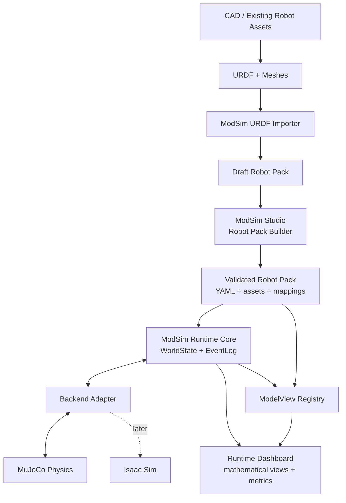

---

## 6. User workflows

### 6.1 Robot Pack Builder workflow

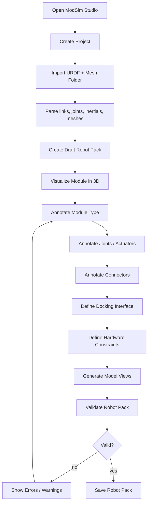

### 6.2 Runtime simulation workflow

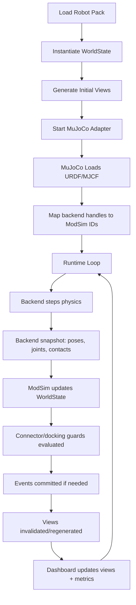

### 6.3 Model-view visualization workflow

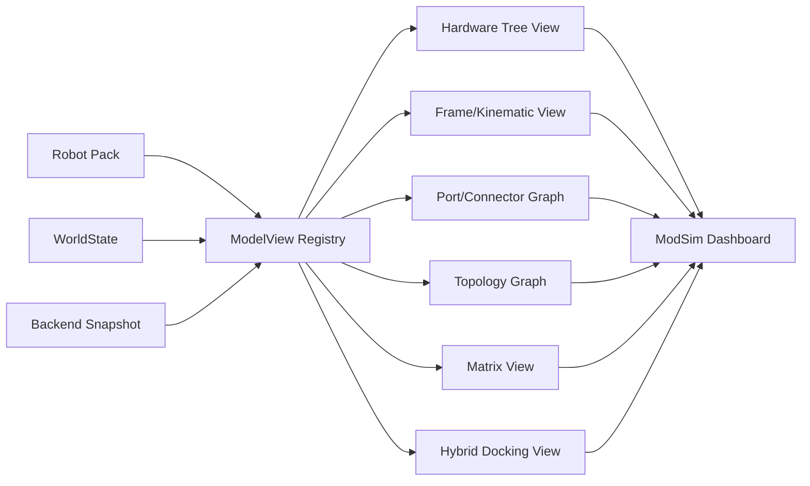

---

## 7. Core domain UML

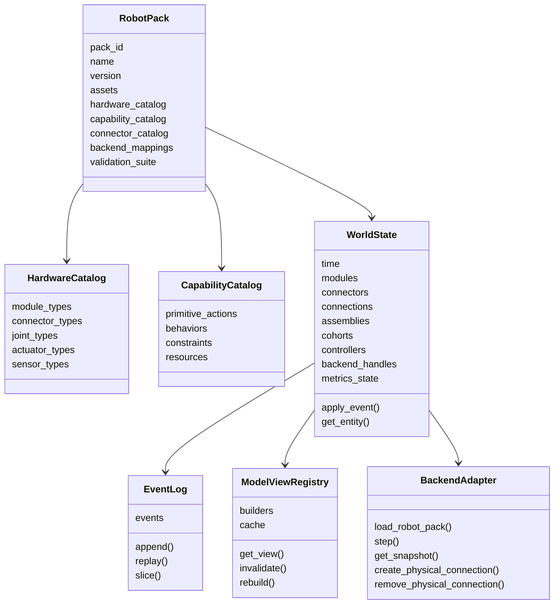

---

## 8. Robot Pack UML

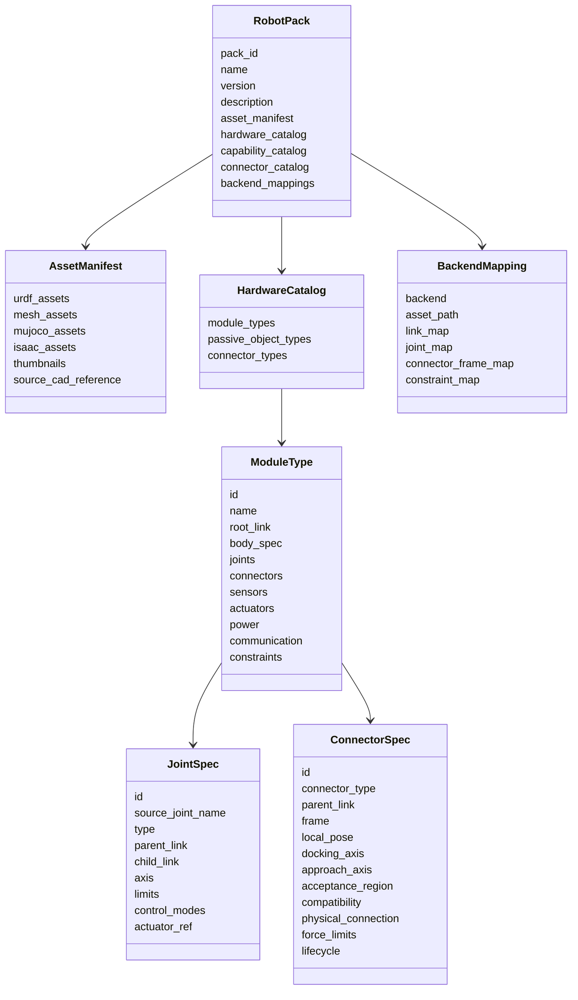

---

## 9. URDF import and draft Robot Pack builder UML

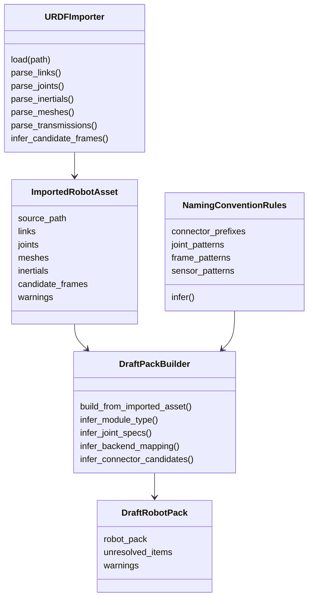

### Importer responsibilities

The importer should parse mechanical information but should not invent docking semantics.

Automatically infer where possible:

```text
links
joints
joint limits
visual meshes
collision meshes
inertial parameters
candidate frames matching connector naming conventions
candidate sensors from frame names
backend link/joint names
```

Require user confirmation for:

```text
module type and role
connector semantic type
docking normal / approach axis
acceptance region
allowed orientations
compatibility rules
latching/release model
connector force/moment limits
power/data transfer
capability actions
```

---

## 10. ModSim Studio architecture

ModSim Studio is a separate desktop application package. It should be implemented with PySide6/Qt and should communicate with the core through typed application services rather than directly mutating raw dictionaries.

### 10.1 Studio technical stack

```text
GUI shell:          PySide6 / QtWidgets
3D viewport:        PyVistaQt + PyVista / VTK
Plots and metrics:  PyQtGraph
URDF parsing:       yourdfpy first, urdfpy fallback if needed
Mesh loading:       trimesh
Schema validation:  Pydantic
YAML editing:       ruamel.yaml
Graph views:        NetworkX initially
```

### 10.2 Studio package boundary

```text
modsim-studio may depend on PySide6, PyVistaQt, PyVista, PyQtGraph, yourdfpy, and trimesh.
modsim-core must not depend on any GUI or visualization packages.
The GUI should call services from modsim-core, modsim-hardware, modsim-models, and modsim-runtime.
```

### 10.3 Studio class UML

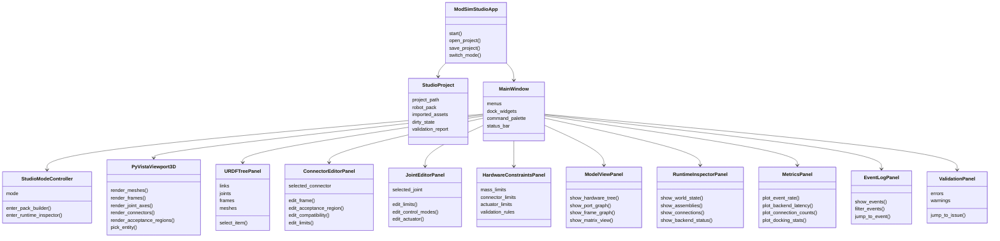

### Studio MVP layout

```text
Left panel:
  project tree
  URDF links
  joints
  meshes
  connector list

Center:
  PyVistaQt 3D viewport
  visual mesh overlay
  collision mesh overlay
  link frames
  joint axes
  connector frames
  docking axes
  acceptance regions

Right panel:
  selected item inspector
  connector editor
  joint editor
  constraints editor

Bottom:
  validation report
  generated YAML preview
  model-view preview
  event log / runtime metrics in Inspector mode
```

### Studio MVP features

```text
Import URDF + meshes
Display URDF link/joint tree
Render meshes in PyVistaQt viewport
Display named frames / generated local frames
Create/edit connector annotations
Create/edit joint metadata
Create/edit hardware constraints
Visualize connector axes and acceptance regions
Validate Robot Pack
Save Robot Pack YAML
Generate preview model views
```

Non-MVP:

```text
full behavior editor
full physics simulation inside Studio
advanced CAD editing
web GUI
Electron/React frontend
Isaac extension UI
cloud collaboration
```

---

## 11. Robot Pack YAML structure

A Robot Pack should be a folder, not one file.

```text
my_robot_pack/
  robot_pack.yaml
  assets/
    urdf/
      module.urdf
    meshes/
      visual/
      collision/
    mujoco/
      module.xml        # optional
    isaac/
      module.usd        # optional
  specs/
    module_types.yaml
    connector_types.yaml
    capabilities.yaml
    docking_models.yaml
    constraints.yaml
  mappings/
    urdf_mapping.yaml
    mujoco_mapping.yaml
    isaac_mapping.yaml
  validation/
    valid_connections.yaml
    invalid_connections.yaml
    test_configurations.yaml
```

### Example `robot_pack.yaml`

```yaml
id: generic_wheeled_module
name: Generic Wheeled Modular Robot
version: 0.1.0

assets:
  urdf: assets/urdf/module.urdf
  meshes: assets/meshes
  mujoco: null
  isaac_usd: null

specs:
  modules: specs/module_types.yaml
  connectors: specs/connector_types.yaml
  capabilities: specs/capabilities.yaml
  docking_models: specs/docking_models.yaml
  constraints: specs/constraints.yaml

mappings:
  urdf: mappings/urdf_mapping.yaml
  mujoco: mappings/mujoco_mapping.yaml
```

### Example `module_types.yaml`

```yaml
module_types:
  mobile_module:
    asset_ref: assets/urdf/module.urdf
    root_link: base_link

    joints:
      - id: left_wheel
        source_joint_name: left_wheel_joint
        type: continuous
        parent_link: base_link
        child_link: left_wheel_link
        control_modes: [velocity]
        limits:
          max_velocity: 10.0
          max_torque: 1.0

      - id: right_wheel
        source_joint_name: right_wheel_joint
        type: continuous
        parent_link: base_link
        child_link: right_wheel_link
        control_modes: [velocity]
        limits:
          max_velocity: 10.0
          max_torque: 1.0

    connectors:
      - id: front
        type: magnetic_face_connector
        parent_link: base_link
        frame: connector_front_frame
        local_pose:
          xyz: [0.05, 0.0, 0.0]
          rpy: [0.0, 0.0, 0.0]

      - id: rear
        type: magnetic_face_connector
        parent_link: base_link
        frame: connector_rear_frame
        local_pose:
          xyz: [-0.05, 0.0, 0.0]
          rpy: [0.0, 0.0, 3.14159]
```

### Example `connector_types.yaml`

```yaml
connector_types:
  magnetic_face_connector:
    active: true
    gender: hermaphroditic
    compatible_with:
      - magnetic_face_connector

    allowed_orientations:
      mode: discrete
      values_deg: [0, 90, 180, 270]

    acceptance_region:
      type: box
      position_tolerance_m: 0.006
      orientation_tolerance_deg: 8
      max_relative_velocity_mps: 0.05

    physical_connection:
      default_constraint: fixed
      compliance:
        translational_stiffness: 10000
        rotational_stiffness: 1000

    limits:
      max_normal_force_n: 90
      max_shear_force_n: 40
      max_bending_moment_nm: 1.8

    lifecycle:
      states:
        - free
        - candidate_detected
        - aligning
        - in_acceptance_region
        - latching
        - docked
        - load_bearing
        - releasing
        - failed
```

---

## 12. Validation architecture

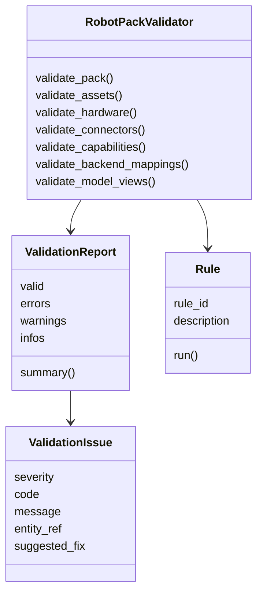

### Initial validation rules

Robot Pack asset rules:

```text
URDF exists
mesh paths resolve
URDF root link exists
all referenced links exist
all referenced joints exist
backend mappings reference existing URDF names
```

Hardware rules:

```text
module type has root link
joint specs reference URDF joints
joint limits are present or explicitly marked unknown
connector specs have parent links
connector frames are valid
mass/inertia values are positive or explicitly approximate
```

Connector/docking rules:

```text
connector type has compatibility rules
connector has local frame or named frame
acceptance region is defined
allowed orientations are defined
physical connection model is defined
force/moment limits are defined or explicitly unknown
undocking support is defined if Dock action is defined
```

View-generation rules:

```text
hardware tree view can be generated
frame graph view can be generated
port graph view can be generated
matrix view can be generated for simple connectivity
```

Backend rules:

```text
MuJoCo mapping can identify bodies/joints/sites or equivalent connector frames
mock backend can instantiate all modules
all module IDs map to backend handles after load
```

---

## 13. Runtime state UML

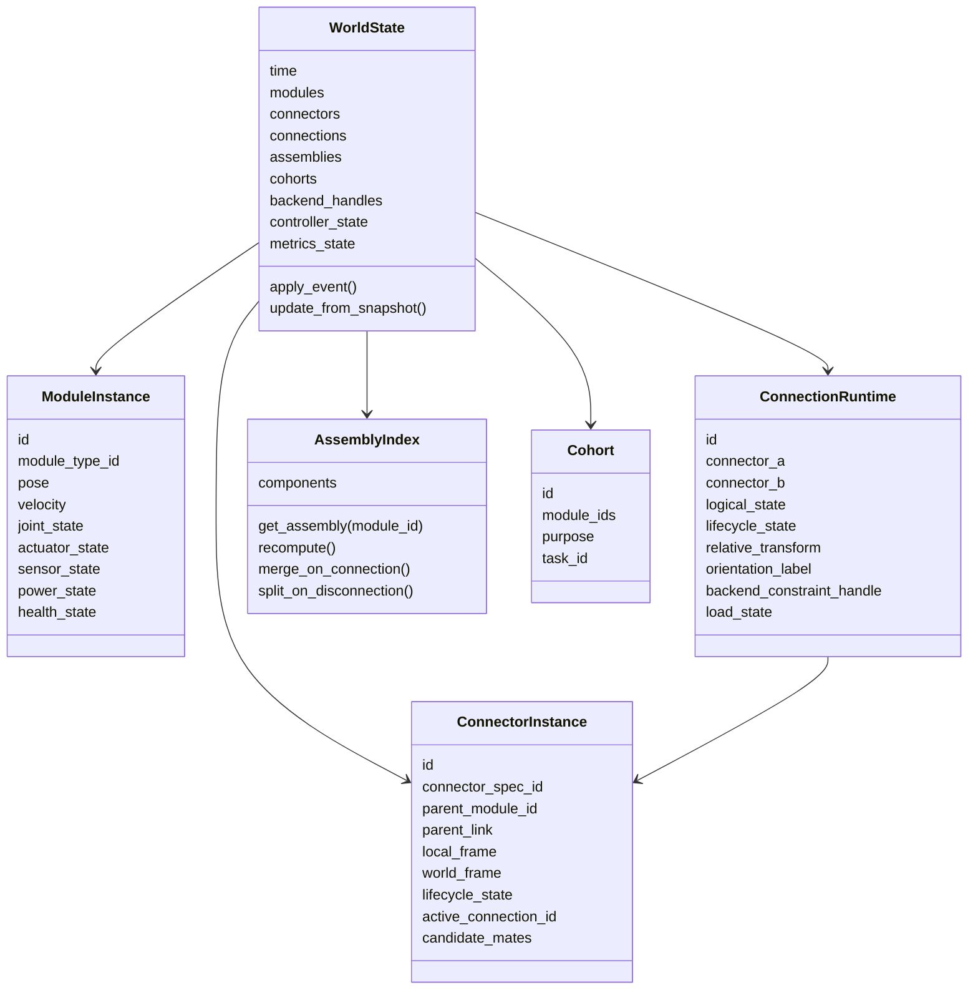

### Important runtime rule

The runtime should never assume there is exactly one robot.

```text
WorldState contains all module instances.
AssemblyIndex derives physical connected components.
A disconnected module is still a valid assembly of size one.
Cohorts represent logical task groups and may contain disconnected modules.
```

---

## 14. Model-view subsystem UML

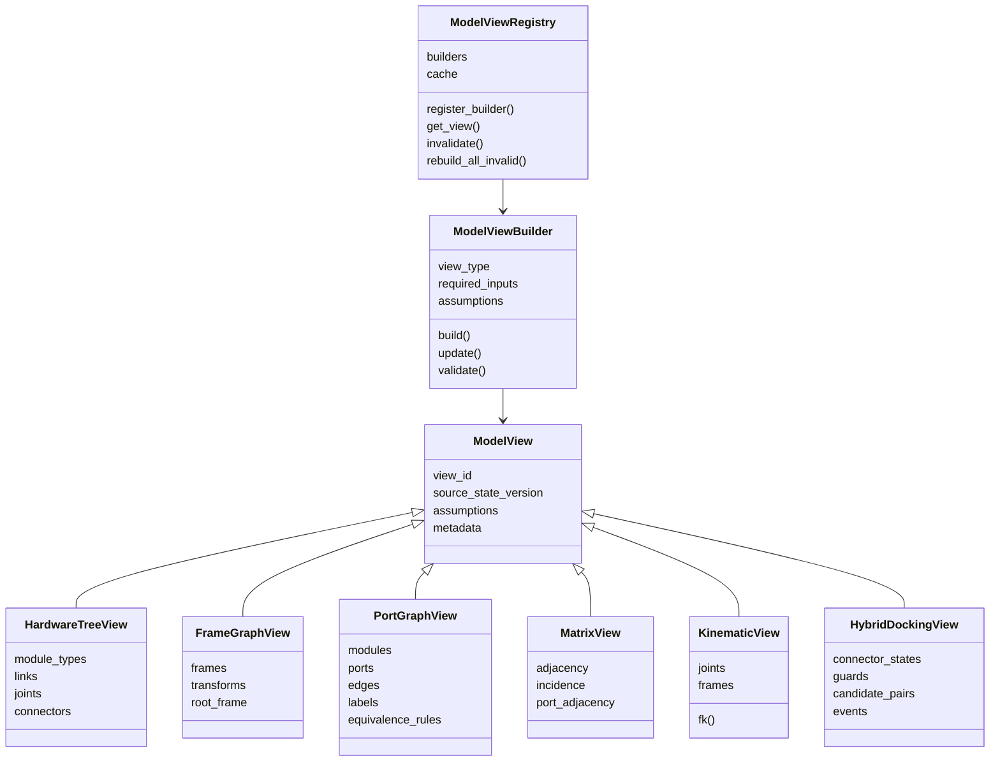

### MVP model views

Implement these first:

```text
HardwareTreeView
FrameGraphView
PortGraphView
TopologyGraphView
MatrixView
HybridDockingView
```

Do not implement full dynamics or lattice views in the first pass. Leave the interfaces ready.

---

## 15. Backend adapter UML

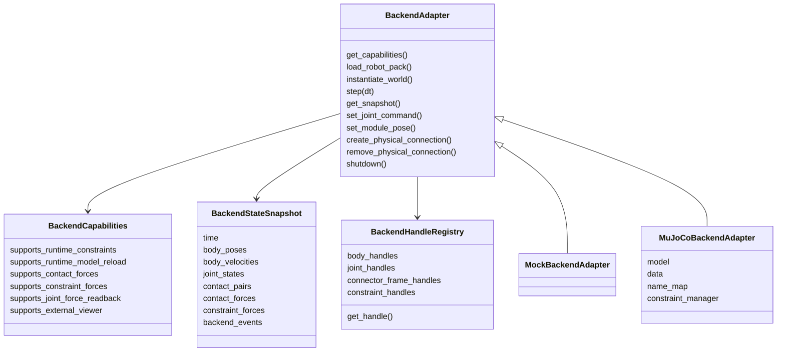

### Backend boundary rule

ModSim should call backend operations such as:

```text
load asset
set command
step physics
read state snapshot
create/remove physical connection
```

The backend should not decide what a modular connector means. ModSim decides semantic meaning.

---

## 16. MuJoCo runtime implementation plan

The first real backend should be MuJoCo.

### MVP MuJoCo capabilities

```text
load a single-module URDF or MJCF asset
instantiate N module copies where possible
map body/joint names to ModSim IDs
read module poses and joint states
send joint commands
step physics
return BackendStateSnapshot
```

### Docking in MuJoCo

For MVP, implement docking first through the mock backend. Then add MuJoCo support.

Potential strategies:

```text
Strategy A: predeclared inactive weld/equality constraints
Strategy B: runtime equality/weld constraint creation if feasible
Strategy C: model reload/recompile for topology changes
Strategy D: force/contact-based soft docking followed by hard constraint
```

Do not block Robot Pack Builder on advanced MuJoCo dynamic-constraint support. The first MuJoCo milestone can load and step the robot; docking can remain mock-backed until the semantics are stable.

### MuJoCo session flow

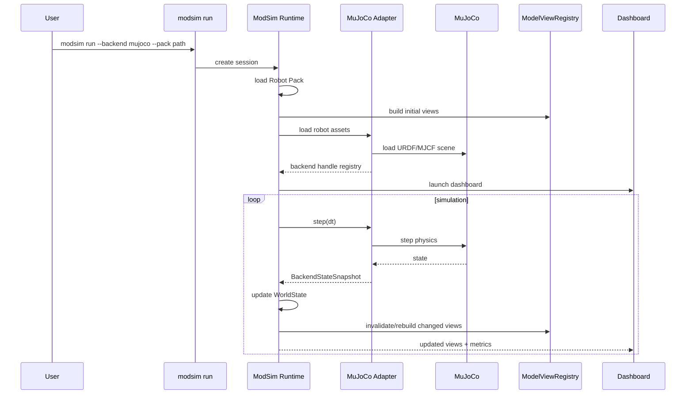

---

## 17. ModSim Studio / Runtime Inspector split

ModSim Studio should be one desktop application with two modes. The user should not have to launch two separate ModSim applications, although MuJoCo/Isaac may open their own simulator viewer windows.

### 17.1 Robot Pack Builder mode

Purpose:

```text
create and validate Robot Packs from CAD-generated assets
```

Inputs:

```text
URDF
meshes
optional MJCF/USD references
optional metadata conventions
existing Robot Pack YAML
```

Outputs:

```text
Robot Pack folder
YAML specs
validation report
backend mapping files
preview model views
```

Primary UI components:

```text
PyVistaQt 3D viewport
URDF link/joint tree
connector editor
joint/actuator editor
hardware constraint editor
validation report
YAML preview
model-view preview
```

### 17.2 Runtime Inspector / Dashboard mode

Purpose:

```text
show what ModSim knows while a backend simulates physics
```

Inputs:

```text
WorldState
EventLog
BackendStateSnapshot
ModelViews
Metrics
```

Outputs:

```text
live semantic visualization
logs
metrics plots
model-view panels
backend sync/debug information
```

Primary UI components:

```text
WorldState tree
AssemblyIndex panel
Connection/connector lifecycle panel
PortGraph/Matrix/FrameGraph model-view panels
Docking event timeline
PyQtGraph metrics dashboard
backend status panel
optional semantic overlay in the PyVistaQt viewport
```

### 17.3 Relationship to simulator UI

For the MVP, do not embed MuJoCo or Isaac rendering into Studio. Prefer two windows:

```text
Simulator viewer:
  physical simulation, contacts, visual motion.

ModSim Studio Runtime Inspector:
  semantic state, modular robot topology, model views, events, metrics, validation/debug data.
```

This keeps Studio backend-agnostic and avoids making MuJoCo/Isaac UI integration a blocker.

### 17.4 Shared UI components

```text
3D viewport widget
entity tree widget
model-view panel
validation panel
metrics panel
event-log panel
property inspector widgets
```

---

## 18. GUI model-view architecture

Use a model-view-controller or model-view-viewmodel pattern. In PySide6, prefer explicit view-model classes and Qt signals/slots over direct mutation from widgets into core state. Keep GUI state separate from core state.

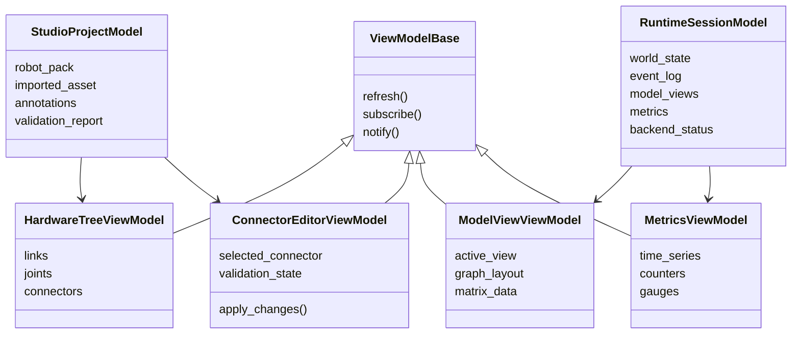

---

## 18.1 GUI implementation rules for Codex

Codex should follow these rules when implementing ModSim Studio:

```text
1. Keep GUI code in `modsim_studio`; do not put Qt/PyVista imports in `modsim_core`.
2. Treat the Robot Pack as the editable document model.
3. Use view-model classes to mediate between widgets and core objects.
4. Keep every user edit as an explicit command where practical: AddConnector, UpdateJointSpec, SetAcceptanceRegion, etc.
5. Make validation visible and actionable; every validation issue should reference the object and field involved.
6. Start with local files only; do not add web services or cloud sync.
7. Do not embed MuJoCo or Isaac viewers in the MVP; let backend viewers run separately and show ModSim semantics in Studio.
8. Use PyVistaQt for robot-pack geometry and semantic overlays: frames, joint axes, connector axes, docking approach vectors, acceptance regions.
9. Use PyQtGraph for runtime metrics and matrix/model-view previews.
10. Make the GUI optional from packaging: `pip install modsim[studio]` should install Studio dependencies.
```

Recommended initial Studio window layout:

```text
Left dock:    Project / URDF tree
Center:       PyVistaQt 3D viewport
Right dock:   Property editor for selected link, joint, connector, or constraint
Bottom dock:  Validation messages, YAML preview, event log in runtime mode
Extra dock:   Model views and metrics in runtime mode
```

---

## 19. Modular-robot metrics

The runtime dashboard should show statistics that are specific to modular robots, not just generic physics data.

### MVP metrics

```text
module_count_total
module_count_connected
module_count_free
assembly_count
largest_assembly_size
connection_count_active
connection_count_planned
connector_count_free
connector_count_candidate
connector_count_docked
docking_attempt_count
docking_success_count
docking_failure_count
undocking_attempt_count
view_invalidations_per_second
event_count_total
backend_step_rate
state_sync_latency_ms
```

### Later metrics

```text
connector_load_estimates
connector_overload_count
actuator_limit_violations
self_collision_warnings
stability_margin
reconfiguration_action_count
assembly_merge_count
assembly_split_count
mean_docking_duration
mean_reconfiguration_duration
graph_diameter
average_module_degree
battery/resource metrics
communication topology metrics
```

### Metrics UML

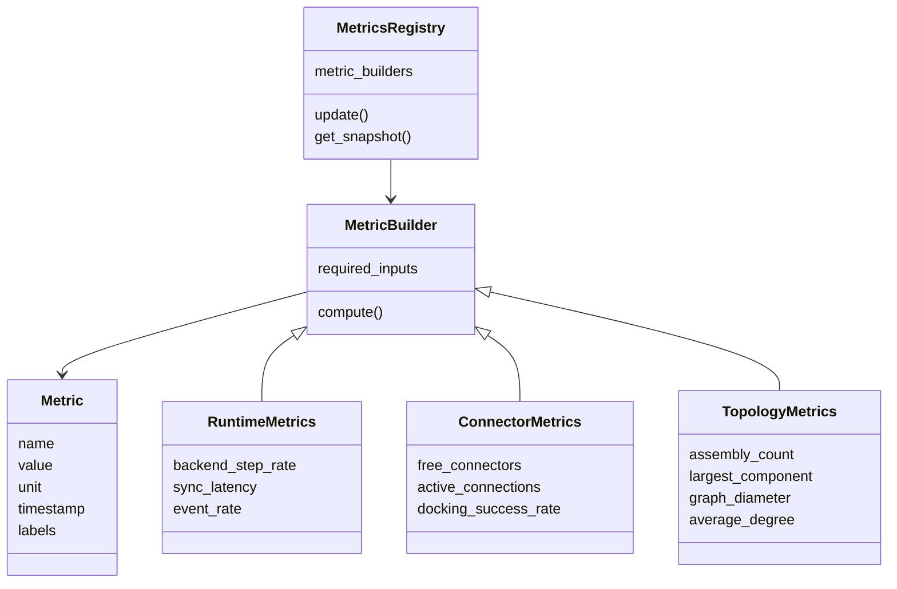

---

## 20. Connector/docking lifecycle UML

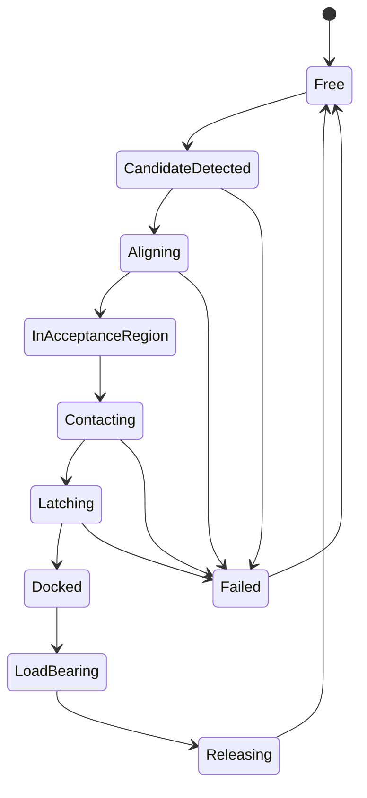

### Docking event sequence

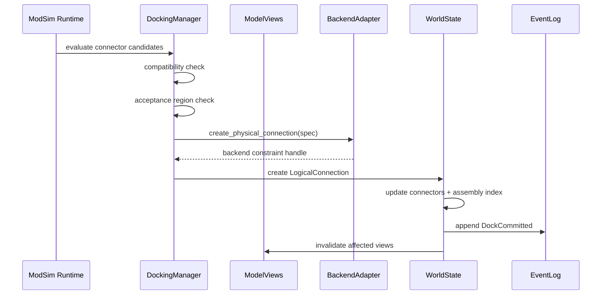

---

## 21. Implementation milestones

### Milestone 0: Repository bootstrap

Deliverables:

```text
pyproject.toml
src/modsim package skeleton
src/modsim_studio package skeleton
src/modsim_backend_mujoco package skeleton
test skeleton
ruff config
pyright/mypy config
pytest config
pre-commit config
basic CLI entry point
```

Acceptance criteria:

```text
uv sync succeeds
pytest succeeds
ruff succeeds
type check succeeds or has documented ignores
modsim --help works
```

---

### Milestone 1: Robot Pack schema and loader

Deliverables:

```text
Pydantic models for RobotPack
AssetManifest
HardwareCatalog
ModuleType
JointSpec
ConnectorSpec
CapabilityCatalog
BackendMapping
RobotPackLoader
RobotPackWriter
RobotPackValidator skeleton
example generic robot pack
```

Acceptance criteria:

```text
load example Robot Pack from YAML
validate basic schema
round-trip save without losing important fields
clear validation errors for missing assets and bad references
```

---

### Milestone 2: URDF importer and draft pack builder

Deliverables:

```text
URDFImporter
ImportedRobotAsset model
DraftPackBuilder
naming convention inference
mesh path resolution
basic CLI: modsim pack init --from-urdf path/to/module.urdf
```

Acceptance criteria:

```text
imports sample URDF
extracts links, joints, limits, inertials, meshes
creates draft Robot Pack folder
adds warnings for missing connector semantics
writes YAML files
```

---

### Milestone 3: ModSim Studio Robot Pack Builder MVP

Deliverables:

```text
PySide6 application shell
project open/save flow
URDF/link/joint/frame tree panel
PyVistaQt 3D viewport showing imported meshes
3D overlays for visual mesh, collision mesh, link frames, and joint axes
entity selection from tree or viewport
connector editor panel
joint editor panel
validation panel
YAML preview panel
save Robot Pack
```

Acceptance criteria:

```text
user opens draft pack
user sees module mesh in the PyVistaQt viewport
user toggles visual mesh, collision mesh, frames, and joint axes
user selects URDF link/joint from the tree and sees it highlighted in 3D
user creates a connector annotation attached to a link/frame
user edits connector frame/tolerances/type
user validates and saves Robot Pack YAML
modsim-core can still run tests without importing any GUI dependencies
```

---

### Milestone 4: Hardware constraints and connector semantics editor

Deliverables:

```text
connector type editor
acceptance region editor
allowed orientations editor
compatibility editor
force/moment limits editor
actuator/joint constraints editor
hardware constraints validator
PyVista overlays for connector axes, mating frames, approach directions, and acceptance regions
basic test-dock preview between two connector definitions
```

Acceptance criteria:

```text
user defines connector type
user defines compatibility rule
user sees docking axis/acceptance region in 3D
user can run a test-dock check between two connector definitions
validator catches missing connector fields and bad frame references
YAML output matches schema
```

---

### Milestone 5: Model-view generation and visualization

Deliverables:

```text
ModelViewRegistry
HardwareTreeView
FrameGraphView
PortGraphView
TopologyGraphView
MatrixView
HybridDockingView skeleton
PySide6 model-view panel with graph/matrix/kinematic tabs
```

Acceptance criteria:

```text
Robot Pack generates hardware tree view
Robot Pack generates frame graph view
WorldState with modules generates port graph and matrix view
Studio can preview views
unit tests cover view invalidation rules
```

---

### Milestone 6: Runtime core and mock backend

Deliverables:

```text
WorldState
ModuleInstance
ConnectorInstance
ConnectionRuntime
AssemblyIndex
EventLog
BackendAdapter interface
MockBackendAdapter
RuntimeSession
RuntimeKernel skeleton
```

Acceptance criteria:

```text
instantiate N disconnected modules
free modules are assemblies of size one
mock dock merges assemblies
mock undock splits assemblies
EventLog records changes
ModelViews update after dock/undock
```

---

### Milestone 7: Runtime Inspector MVP

Deliverables:

```text
runtime inspector mode in ModSim Studio
WorldState tree panel
assembly/connection panel
port graph panel
matrix/model-view panel
event log and docking lifecycle timeline
PyQtGraph metrics panel
backend status panel
optional PyVista semantic overlay panel for modules/connectors/assemblies
```

Acceptance criteria:

```text
run mock runtime session
dashboard displays modules, connectors, assemblies, and active connections
dashboard updates after dock/undock
dashboard shows modular-robot metrics and event log
model-view visualization updates after state changes
```

---

### Milestone 8: MuJoCo backend MVP

Deliverables:

```text
MuJoCoBackendAdapter
load URDF or MJCF asset
map backend names to ModSim IDs
read body poses and joint states
send basic joint commands
step physics
return BackendStateSnapshot
CLI: modsim run --backend mujoco --pack path
```

Acceptance criteria:

```text
MuJoCo opens/loads the module asset
ModSim creates WorldState from Robot Pack
adapter syncs poses/joints back into WorldState
runtime dashboard displays live state
no dynamic docking required yet
```

---

### Milestone 9: Docking/undocking with backend bridge

Deliverables:

```text
DockingManager
Connector candidate detection using backend poses
DockingGuard
Mock backend physical connection support
MuJoCo physical connection prototype
ConnectionRuntime with backend constraint handle
view invalidation after dock/undock
```

Acceptance criteria:

```text
mock backend docking fully works
MuJoCo backend can create at least one simple fixed/weld-like connection or documents limitation
ModSim commits logical connection only after backend success
failed backend constraint creation produces DockFailed event
```

---

## 22. First GitHub issues for Codex

### Issue 1: Create Python project skeleton

Implement project skeleton, pyproject, lint/type/test config, and empty packages.

### Issue 2: Implement Robot Pack schema models

Implement `RobotPack`, `AssetManifest`, `HardwareCatalog`, `ModuleType`, `JointSpec`, `ConnectorSpec`, and `BackendMapping` models with Pydantic validation.

### Issue 3: Implement Robot Pack loader/writer/validator

Load YAML Robot Packs, validate references, and round-trip save.

### Issue 4: Implement URDF importer

Parse a URDF into `ImportedRobotAsset`: links, joints, inertials, mesh paths, limits, and candidate frames.

### Issue 5: Implement draft Robot Pack builder

Given a URDF, create a draft Robot Pack folder and YAML files with unresolved warnings.

### Issue 6: Implement ModSim Studio shell

Create PySide6 app with project open/save, dockable tree panel, embedded PyVistaQt viewport, validation panel, and basic project state.

### Issue 7: Add mesh rendering and connector annotation

Render URDF meshes in the PyVistaQt viewport, show link frames/joint axes, and let a user create/edit a connector annotation attached to a link/frame.

### Issue 8: Implement model-view registry and first views

Generate HardwareTreeView, FrameGraphView, PortGraphView, and MatrixView from Robot Pack and WorldState.

### Issue 9: Implement runtime core and mock backend

Add WorldState, EventLog, AssemblyIndex, BackendAdapter, MockBackend, and mock dock/undock.

### Issue 10: Implement runtime dashboard MVP

Display WorldState tree, event log, port graph, matrix, and metrics in the GUI.

### Issue 11: Implement MuJoCo backend MVP

Load a Robot Pack asset in MuJoCo, sync pose/joint state into ModSim, and display in dashboard.

---

## 23. CLI targets

Initial CLI commands:

```text
modsim --help
modsim pack init --from-urdf path/to/module.urdf --out my_robot_pack/
modsim pack validate my_robot_pack/
modsim studio my_robot_pack/
modsim views my_robot_pack/
modsim run --backend mock --pack my_robot_pack/
modsim run --backend mujoco --pack my_robot_pack/
```

---

## 24. Test strategy

### Unit tests

```text
schema validation
YAML round-trip
URDF parsing fixtures
connector compatibility
acceptance-region math
assembly-index merge/split
model-view generation
metrics computation
```

### Integration tests

```text
URDF → draft pack → validate
Robot Pack → WorldState → views
WorldState → mock dock → assembly merge → event log
WorldState → mock undock → assembly split → event log
Robot Pack → mock runtime dashboard model
```

### GUI tests

Use `pytest-qt` after the GUI shell stabilizes.

```text
open project
select link
create connector
edit connector field
run validation
save pack
```

### Backend tests

MuJoCo tests should be optional and skipped if MuJoCo is not installed.

```text
pytest -m mujoco
```

---

## 25. MVP definition of done

The first major MVP is complete when:

```text
1. A user can import a URDF and mesh folder.
2. ModSim creates a draft Robot Pack.
3. ModSim Studio visualizes the module.
4. User can define connectors, docking interface metadata, joints, and constraints.
5. Robot Pack validates successfully.
6. ModSim generates initial mathematical views.
7. Mock runtime can instantiate disconnected modules.
8. Mock dock/undock updates WorldState, assemblies, event log, and views.
9. Runtime dashboard shows WorldState, model views, metrics, and event log.
10. MuJoCo backend can load the URDF/MJCF and sync basic state into ModSim.
```

Dynamic MuJoCo docking is a follow-up milestone, not required for the first MVP.

---

## 26. Design rationale from the literature

Keep these principles visible while implementing:

1. Modular robot tools need interactive design and verification, because users must create and validate configurations and behaviors quickly.
2. A module description needs joints, attachment/connectors, kinematics, geometry, mass, and constraints.
3. A configuration can be represented in many mathematical forms; do not make graph the only model.
4. Configuration recognition and reconfiguration depend on connector labels, orientations, symmetry/equivalence rules, and matching/mapping algorithms.
5. Self-assembly requires disconnected modules to remain first-class state entities.
6. Docking is difficult and should be modeled explicitly as lifecycle/state-machine behavior.
7. High-level task systems rely on libraries of configurations, behaviors, properties, and environment assumptions.
8. Passive modules and environment objects should remain possible, not excluded by the architecture.

---

## 27. First Codex prompt

Use this prompt when starting Codex:

```text
You are implementing ModSim, a Python-first modular robotics framework. Read AGENTS.md and HANDOFF.md first. Preserve the architecture: ModSim is not a physics engine, URDF is an imported mechanical asset, Robot Pack YAML is the modular-robot semantic layer, WorldState is canonical, graphs are generated views, and docking/undocking are first-class events.

Start with Milestone 0 and Milestone 1 only: create the Python project skeleton, package layout, pyproject.toml, CLI shell, Pydantic Robot Pack schema models, YAML loader/writer, and an example generic robot pack. Do not implement MuJoCo, Isaac, or a full GUI yet. Add tests for schema validation and YAML round-trip.
```

Then continue with:

```text
Proceed to Milestone 2: implement URDFImporter and DraftPackBuilder. Given a URDF path, extract links, joints, inertials, mesh references, limits, candidate frames, and create a draft Robot Pack folder with validation warnings for missing modular semantics.
```

Then:

```text
Proceed to Milestone 3: implement the ModSim Studio Robot Pack Builder MVP using PySide6 with an embedded PyVistaQt viewport. It should open a Robot Pack, display the URDF link/joint/frame tree, render imported meshes, show link frames and joint axes, provide connector and joint editors, preview YAML, run validation, and save the Robot Pack. Keep all Qt/PyVista imports outside modsim-core.
```

---

## 28. Non-goals for the first implementation

Do not implement these in the first pass:

```text
full Isaac Sim adapter
full behavior editor
formal mission planner
advanced lattice planner
full dynamic MuJoCo docking
large-scale swarm algorithms
cloud robot-pack sharing
CAD-to-URDF generation
custom physics engine
hardware drivers
```

Do not let these future features distort the first MVP.

---

## 29. Summary architecture statement

> ModSim is a Python-first, backend-agnostic framework for modular robotics. It imports CAD-generated robot assets, enriches them with modular-robot semantics through Robot Packs, provides a standalone PySide6/PyVistaQt GUI for defining hardware and docking interfaces, maintains canonical runtime state for modules/connectors/connections/events, generates mathematical model views for algorithms and visualization, and coordinates with external physics engines such as MuJoCo through adapter interfaces. MuJoCo handles physics; ModSim handles modular-robot meaning.
