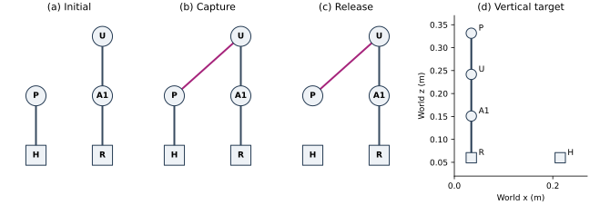
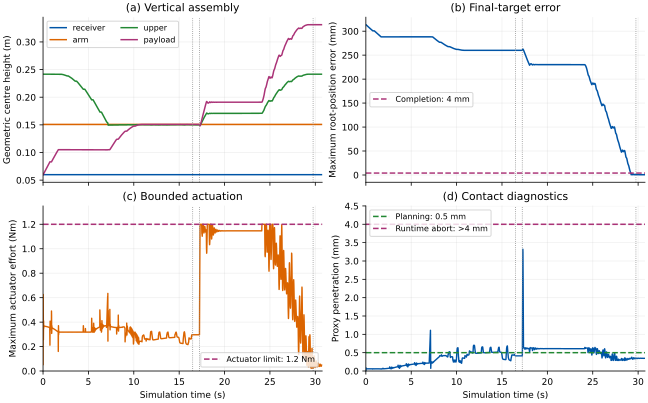

# Planning Elevated SMORES-EP Reconfiguration in ModSim

## A hybrid graph-and-joint-space method for a four-module vertical chain

**Technical manuscript · Working draft 0.1 · 23 September 2026**

**Status:** implementation-grounded mathematical review. This manuscript makes
no claim of a new general reconfiguration theorem or hardware validation.

### Abstract

Reconfiguration of articulated modular robots requires both a change in
connectivity and an executable motion between attachment states. We formalize
a ModSim implementation that separates these decisions into a finite
connector-state search, two sampled joint-space searches, and a feedback-driven
execution controller. Five SMORES-EP models, including two fixed bases,
transfer a payload from a helper to a receiving chain and unfold a four-module
vertical tower. We give the state representation, kinematic equations, search
objectives, docking guards, servo law, and termination conditions, with proofs
of the limited discrete guarantees. A reference simulation completes in
30.759 s with 0.568 mm maximum final root-position error. It reaches the
1.2 N·m actuator limit and admits nonzero contact-proxy penetration. The result
supports the implemented handoff under the stated simulation assumptions; it
does not establish continuous collision avoidance, connector load capacity,
online replanning, or arbitrary three-dimensional reachability. A separate
formulation identifies the certificates needed for these stronger claims.

**Keywords:** modular robotics; SMORES-EP; spatial reconfiguration; hybrid
planning; support transfer; ModSim; MuJoCo.

## 1. Introduction and scope

A modular robot has two coupled kinds of configuration: which connectors are
attached, and where the articulated bodies are located. A valid connector
graph does not establish that its spatial arrangement can be reached, held
against gravity, or assembled without interference. Reaching a geometric
pose does not establish that the required connection has committed.

We study a restricted task: an already assembled receiving chain accepts an
elevated payload while a helper continues supporting it; the helper releases
after capture, and the chain unfolds vertically. ModSim owns planning and
connection semantics. MuJoCo supplies mechanical queries and bounded actuation.

The contribution of this draft is an auditable mathematical description of
the implementation and its limits. BFS and A* are standard algorithms. The
benchmark supplies module roles, port pairs, fixtures, and a rendezvous;
it does not discover them. Both searches finish before execution. Feedback
and docking decisions run during execution, but there is **no online
replanning or recovery search**.

“3D” describes spatial rigid-body transforms and elevated articulated motion.
A vertical chain remains a serial tree and can have a planar embedding.
This experiment does not demonstrate a target that cannot be flattened under
its mechanical and task constraints.

## 2. Relationship to previous SMORES work

Liu, Whitzer, and Yim [1] use connector-labelled graphs, common
subconfigurations, module correspondence, and distributed action ordering.
Those ideas motivate separating connectivity from execution; this prototype
does not reproduce their matching algorithm.

Liu, Lin, Kim, and Yim [2] map suitable tree topologies to non-overlapping
planar arrangements, assign modules, and coordinate assembly. Their hardware
demonstrations already use helpers to lift and orient modules. Elevated
motion or a helper is therefore not, by itself, a new contribution. Our
benchmark instead starts from supplied subassemblies and changes support
while executing attached joint motion.

Liu and Yim [3] formulate manipulation using sequential constrained quadratic
programs. That solver could become a motion component in a future assembly
planner. The current implementation uses sampled joint-space A* and does not
implement their QP controller.

These distinctions do not establish broader reachability or superior
performance. This draft includes no matched hardware comparison, comparative
benchmark suite, or exhaustive novelty survey.

## 3. State, connector geometry, and the goal

### 3.1 Notation

| Symbol | Meaning |
| --- | --- |
| $V$ | Finite module set |
| $C_i$ | Connectors belonging to module $i$ |
| $E$ | Undirected bonds between specific connector instances |
| $A$ | Modules with root bodies fixed to the environment |
| $X_i=(R_i,p_i)$ | World pose of module root $i$, in $SE(3)$ |
| $q_i$ | Internal joint coordinates of module $i$ |
| $F_{ic}(q_i)$ | Connector $c$ pose relative to module root $i$ |
| $T_{ic}=X_iF_{ic}(q_i)$ | Connector world pose |
| $u$ | Integer joint-grid coordinates |
| $\Phi_E(u)$ | Nominal forward-kinematic configuration in mode $E$ |
| $\widehat{\mathcal{F}}_E$ | Implemented sampled feasibility predicate |

A bond identifies ports, not merely adjacent modules:

$$
e=\{(i,c),(j,d)\},\qquad i\ne j.
\tag{1}
$$

The set of globally identified ports is
$\mathcal{P}=\{(i,c):i\in V,\ c\in C_i\}$.

The search's `Bond` stores canonical port identifiers. It does **not** store
or search mating orientation. The benchmark supplies a nominal mating
transform; the runtime records measured relative pose and accepted discrete
orientation on each committed connection.

For conceptual analysis, a hybrid physical state is

$$
s=(E,X,q,v),\qquad X\in SE(3)^{|V|}.
\tag{2}
$$

Here $v$ includes root twists and internal joint velocities. Fixture poses
and ground geometry are fixed task data. The implementation searches $E$
and a three-dimensional coordinate $u$, not the full state in (2).

### 3.2 Attachment geometry

Let $M_e$ map the second connector frame into the first at a nominal mate.
An ideal retained connection satisfies

$$
X_jF_{jd}(q_j)=X_iF_{ic}(q_i)M_e.
\tag{3}
$$

For a rooted attachment tree, compute the child root recursively:

$$
X_j=X_iF_{ic}(q_i)M_eF_{jd}(q_j)^{-1}.
\tag{4}
$$

Equation (4) stages the initial scene and evaluates an isolated scratch
model. It is not a live root-placement controller. During execution, physics
integrates root poses. Connector frames derive from the imported articulated
asset and Robot Pack sites. The benchmark uses $M_e=(R_z(\pi),0)$, a choice
specific to these authored frames, not a universal mating convention.

Docking uses measured alignment. At capture time $t_c$, the committed transform is

$$
\widehat{M}_e=T_{ic}(t_c)^{-1}T_{jd}(t_c).
\tag{5}
$$

There is no nominal snap. The post-transfer query model continues using
$M_e$, whereas execution retains $\widehat{M}_e$. The difference is a source
of clearance and final-pose error.

### 3.3 Goal semantics

A complete physical goal would constrain bonds, root poses, joints, and
velocities. The implemented completion predicate is narrower: exact port
bonds, a receiving-root **translation** bound, and internal-joint settling.
It does not independently check all root orientations or root twists.

Geometric module centres in the figures are midpoints of left/right wheel
connector origins. They are neither URDF root origins nor centres of mass.
Thus a vertical stack can have different root $x$ coordinates.

## 4. Benchmark construction

Write $H,P,R,A_1,U$ for `helper`, `payload`, `receiver`, `arm`, and `upper`.
Roots $H$ and $R$ are fixed. Define:

| Bond | Connector pair | Role |
| --- | --- | --- |
| $e_{HP}$ | `helper/pan` ↔ `payload/bottom` | Initial helper support |
| $e_{RA}$ | `receiver/pan` ↔ `arm/bottom` | Retained lower bond |
| $e_{AU}$ | `arm/pan` ↔ `upper/bottom` | Retained upper bond |
| $e_{UP}$ | `upper/pan` ↔ `payload/left` | Elevated capture |

The relevant modes are

$$
E_0=\{e_{HP},e_{RA},e_{AU}\},\qquad E_+=E_0\cup\{e_{UP}\}.
\tag{6}
$$

$$
E_*=E_+\setminus\{e_{HP}\},\qquad A=\{H,R\}.
\tag{7}
$$

The final chain is $R\rightarrow A_1\rightarrow U\rightarrow P$. The helper
remains a separate fixed module. Initial subassembly construction is supplied,
not an autonomous result of the planner.



*Figure 1. Logical attachment modes and nominal vertical target. Squares mark
fixed bases. Connector pairs are defined in the table. The target panel
shows geometric module centres, not collision volumes.*

### 4.1 Coordinates and rendezvous

Twenty joint servos are provisioned. Three vary along the plan. With
$\Delta=\pi/12$ radians and $u=(h,a,w)$,

$$
q_{H,\mathrm{tilt}}=-h\Delta,\quad q_{A_1,\mathrm{tilt}}=a\Delta,\quad q_{P,\mathrm{left}}=w\Delta.
\tag{8}
$$

Receiver tilt is held at $-\pi/2$; the other sixteen targets are zero.

$$
\mathcal{U}=\{0,1,\ldots,6\}^3,\quad u_0=(0,0,0),\quad u_c=(6,6,6),\quad u_*=(0,0,6).
\tag{9}
$$

The receiving chain begins upright, folds toward the helper, captures the
payload, then straightens with the new module attached. Fixture poses are
computed from (4) at $u_c$, fixing the receiver at $(0,0,0.06)$ m. The helper
root is approximately $(0.215056,-0.034458,0.06)$ m, yawed by $90^\circ$.
Neither fixture placement nor rendezvous is searched.

| Module | Root $x$ (m) | Root $y$ (m) | Root $z$ (m) | Centre $z$ (m) |
| --- | --- | --- | --- | --- |
| receiver | 0.000000 | 0 | 0.060000 | 0.060000 |
| arm | 0.034458 | 0 | 0.116416 | 0.150874 |
| upper | 0.034458 | 0 | 0.207289 | 0.241747 |
| payload | 0.068916 | 0 | 0.331471 | 0.331471 |

These are nominal final positions. All four centres lie at $x=0.034458$ m,
$y=0$. Targets use $\Phi_{E_*}(u_*)$, not rendezvous geometry.

## 5. Discrete support-mode planning

### 5.1 Admissibility

Let $G_E$ be the module graph obtained by forgetting port labels. Define

$$
\operatorname{exclusive}(E)\Longleftrightarrow \forall\chi\in\mathcal{P},\quad\sum_{e\in E}\mathbf{1}[\chi\in e]\leq1,
\tag{10}
$$

$$
\operatorname{anchored}(E)\Longleftrightarrow \forall i\in V,\quad \exists b\in A:\ i\leadsto_{G_E} b.
\tag{11}
$$

The implemented support predicate is

$$
\mathcal{S}(E)=\operatorname{exclusive}(E)\wedge\operatorname{anchored}(E).
\tag{12}
$$

An isolated fixed base satisfies (11) by its zero-length self-path.
Disconnected subassemblies are permitted if each has an anchor. Unknown
modules and invalid identifiers are rejected. Graph reachability proves no
bound on fixture reactions, connector loads, torques, or tipping risk.

### 5.2 Search and objective

Candidate bonds are limited to the supplied set:

$$
\mathcal{B}=E_0\cup E_*,\qquad E'=E\triangle\{e\},\quad e\in\mathcal{B}.
\tag{13}
$$

Symmetric difference toggles one bond. BFS retains neighbors satisfying
$\mathcal{S}(E')$ and minimizes toggle count, at unit cost per change. It uses
deterministic bond ordering and a 4096-state budget. Here $|\mathcal{B}|=4$,
so at most sixteen subsets exist before pruning. It does not search all
physically available connector pairs.

**Algorithm 1 — Connector-state BFS**

```text
require S(E0) and S(Egoal)
queue <- [(E0, empty actions)]; seen <- {E0}
while queue is not empty:
    E, actions <- pop front
    if E == Egoal: return actions
    for e in sorted(E0 union Egoal):
        Enew <- E symmetric_difference {e}
        if Enew in seen or not S(Enew): continue
        if state budget exhausted: fail
        action <- dock(e) if e absent from E, otherwise release(e)
        mark Enew seen; enqueue (Enew, actions + action)
fail: no admissible path in supplied bond set
```

### 5.3 Discrete guarantees

**Proposition 1 — Invariant.** Every mode on a returned BFS path satisfies (12).

*Proof.* The initial mode is checked. Successors are inserted only after
checking (12). Induction over path length establishes the result. This is
a property of searched modes, not continuous mechanical stability.

**Proposition 2 — Minimal handoff.** The shortest admissible sequence here
captures $e_{UP}$ before releasing $e_{HP}$.

*Proof.* Initial and final sets differ in two bonds, requiring at least two
toggles. Releasing $e_{HP}$ first isolates the unanchored payload. Capturing
$e_{UP}$ first uses distinct ports and preserves anchor paths; releasing
$e_{HP}$ afterward leaves a receiver path. This admissible two-toggle
sequence meets the lower bound.

BFS is complete and shortest on its finite supplied graph when the budget
permits the required exploration. The hybrid planner is not thereby complete:
it does not backtrack to another mode sequence if motion fails. The executor
currently accepts only “one dock, then one release.”

In $E_+$ the module graph remains a tree. Adding an environment node joined
to both fixed bases creates a closed loop. Dual support can therefore cause
redundant mechanical constraints without a cycle in the module-only graph.

## 6. Joint-space motion planning

### 6.1 Samples and oracle

Grid neighbors differ by one unit in one coordinate. An edge $u\rightarrow u'$
is checked at

$$
u_k=u+\frac{k}{s}(u'-u),\qquad k=1,\ldots,s.
\tag{14}
$$

Approach uses $s=5$ (3° spacing); withdrawal uses $s=15$ (1° spacing).
Start and goal are explicitly tested. Accepted predecessors were already
tested, so both edge endpoints are covered.

The provider evaluates $\Phi_E(u_k)$ on separate scratch data and computes
maximum penetration over inter-module and module–ground contacts:

$$
\delta_E(u)=\max\left(\{0\}\cup\{-d_k:\ k\in\mathcal{C}_E(u)\}\right).
\tag{15}
$$

Here $d_k$ is signed contact distance. Contacts between bodies of the same
module are excluded. Collision geometry is the pack's contact proxies, not
complete swept visual CAD geometry. The actual oracle is

$$
\widehat{\mathcal{F}}_E(u)=[\delta_E(u)\leq0.0005]\wedge[\tau_{\max}\geq2mg\ell],\quad \ell=0.10\,\mathrm{m}.
\tag{16}
$$

$m$ is imported mass divided by five, approximately 0.438637 kg. The torque
threshold is about 0.861 N·m. It is **state-independent**, inherited from a
helper-lift screen; it is neither inverse statics nor an upper bound for the
loaded receiving chain. Positive penetration is permitted. Oracle acceptance
therefore does not mean collision-free, mechanically certified execution.

Grid bounds restrict the named tilts to nominal 90° ranges. There is no
separate general joint-limit oracle for arbitrary coordinate mappings.

### 6.2 A* and its optimality boundary

Each edge costs one. For goal $u_g$,

$$
H(u)=\sum_{r=1}^{3}|u_r-u_{g,r}|,\qquad f(u)=g_{\mathrm{search}}(u)+H(u).
\tag{17}
$$

The two searches are

$$
\pi_0=\operatorname{A*}(u_0,u_c;\widehat{\mathcal{F}}_{E_0}),\qquad \pi_*=\operatorname{A*}(u_c,u_*;\widehat{\mathcal{F}}_{E_*}).
\tag{18}
$$

There is no motion search inside $E_+$; both attachments are held at the
rendezvous during transfer.

**Algorithm 2 — Sampled joint-grid A***

```text
require valid grid and feasible endpoints
push start; best_cost[start] <- 0; closed <- empty
while heap is not empty:
    u <- pop smallest cost + Manhattan heuristic
    if u closed: continue
    if expansion budget exhausted: fail
    close u
    if u == goal: reconstruct parent path; return
    for each in-bounds one-axis neighbor v:
        if v closed or best_cost[v] <= best_cost[u] + 1: continue
        if any sample on (u, v] fails the oracle: continue
        parent[v] <- u; best_cost[v] <- best_cost[u] + 1
        push v with priority best_cost[v] + H(v)
fail: no accepted grid path
```

**Proposition 3 — Grid optimality.** With deterministic queries and sufficient
budget, A* returns a minimum-edge path in the accepted sampled-edge graph.

*Proof.* Every unit edge changes one coordinate by one, so
$H(u)\leq1+H(u')$. The heuristic is consistent and lower-bounds remaining
edge count. Closing nodes after minimum-priority expansion is therefore
valid, and A* yields a shortest path [4]. Removing edges with the oracle
preserves that lower bound.

There are at most 343 vertices, each with degree at most six, below the
4096-expansion budget. Optimality concerns edge count, not execution time,
energy, torque, or clearance. Sampling gives no guarantee between samples.
The returned paths have eighteen and twelve edges, equal to their endpoint
Manhattan lower bounds.

## 7. Measured execution and connection lifecycle

### 7.1 Dynamics and actuation

A useful idealized mechanical model in generalized velocity coordinates is

$$
M(z)\dot v+b(z,v)=S^T\tau+J_E(z)^T\lambda_E+J_A(z)^T\lambda_A+J_C(z)^T\lambda_C.
\tag{19}
$$

$z$ includes root poses and joints; $b$ includes gravity and velocity-dependent
terms. Jacobians map connection, fixture, and contact reactions. This is a
reference model, not an equation solved by the planner. MuJoCo integrates
dynamics with regularized constraints [5]. The experiment uses gravity,
1 ms steps, implicit-fast integration, and 2 ms weld time constants. Fixed
connection semantics use numerical welds without a calibrated magnetic
holding or breakaway model.

Let $r_k$ be the active twenty-joint waypoint target and $c_k$ the commanded
reference. The controller slews each component:

$$
c_{k+1}=c_k+\operatorname{clip}(r_k-c_k,-\omega_c\Delta t,\omega_c\Delta t),
\tag{20}
$$

where $\omega_c=0.35$ rad/s and $\Delta t=0.001$ s. The bounded position
actuators implement

$$
\tau_j=\operatorname{clip}\left(K_p(c_j-q_j)-K_v\dot q_j,-\tau_{\max},\tau_{\max}\right).
\tag{21}
$$

| Setting | Value |
| --- | --- |
| $K_p$ | 150 N·m/rad |
| $K_v$ | 0.6 N·m·s/rad |
| $\tau_{\max}$ | 1.2 N·m per joint |
| Armature inertia | 0.0005 kg·m² per internal joint |
| Gravity magnitude | 9.81 m/s² |
| Deadline | 45 simulated seconds |

These are provisional simulation parameters, not calibrated SMORES-EP
ratings. Reference slew does not prove a bound on measured velocity or
acceleration. After staging, only internal servo references are commanded:
there is no root-pose, root-velocity, or external-body-wrench control.

### 7.2 Settling and supervisory states

The controller reads joint states from canonical ModSim `WorldState`:

$$
e_q(k)=\max_j|r_{k,j}-q_j(k)|,\qquad v_q(k)=\max_j|\dot q_j(k)|.
\tag{22}
$$

A waypoint settles when $e_q<0.018$ rad and $v_q<0.04$ rad/s hold for at least
0.15 s. The reference in (22) is the waypoint, not the slewed command. New
waypoints reset this timer. Root twists are not in this predicate.

```text
moving -> transfer -> retreat -> verify -> complete
any active state -> failed / stopped / timeout
```

Each step checks observation timestamps, finite states and joint feedback,
anchor-path reachability, and proxy penetration. Penetration above 4 mm
aborts. Failure to settle for more than 15 s since the current waypoint/phase
began fails tracking. The overall deadline applies independently.

### 7.3 Measured docking acceptance

After the last approach waypoint settles, the controller requests capture.
For each connector, express mate displacement $d$ and unit docking axis $n$
in its frame. The cylindrical acceptance test is

$$
|n^Td|\leq\epsilon_p,\qquad \|d-(n^Td)n\|_2\leq\epsilon_p,\quad \epsilon_p=0.006\,\mathrm{m}.
\tag{23}
$$

Both connectors must pass. This is **not** a 6 mm Euclidean-radius test:
axial and radial tolerances are separate. World docking axes must satisfy

$$
\arccos(\operatorname{clip}(-n_a^Tn_b,-1,1))\leq\epsilon_R,\qquad \epsilon_R=\pi/18.
\tag{24}
$$

Roll is checked against $\Theta=\{0,\pi/2,\pi,3\pi/2\}$. For signed roll $\rho$,

$$
\max_{\sigma\in\{-1,1\}}\min_{\theta\in\Theta}|\operatorname{wrap}(\sigma\rho-\theta)|\leq\epsilon_R.
\tag{25}
$$

Connector-point relative speed must satisfy

$$
\|v_a-v_b\|_2\leq0.05\,\mathrm{m/s}.
\tag{26}
$$

Connector velocity includes the angular-velocity lever-arm term.
Compatibility, port occupancy, command policy, cooldown, and backend support
are additional guards. A logical bond commits only after the backend confirms
its physical constraint. Refused capture leaves the helper attached.

### 7.4 Release and completion

After capture, hold both attachments for at least 0.75 s and require settling
before release. Confirm the capture remains committed, request removal of
$e_{HP}$, and verify removal. A refused release prevents withdrawal. This
dwell checks connection existence and tracking, not connector load transfer.

The withdrawal path first moves $(6,6,6)$ to $(6,5,6)$, raising the chain for
clearance, then lowers the helper to $(0,5,6)$ and unfolds to $(0,0,6)$. Full
paths accompany the reference data. For $V_R=\{R,A_1,U,P\}$, final error is

$$
e_p=\max_{i\in V_R}\|p_i-p_i^*\|_2.
\tag{27}
$$

Completion requires $E=E_*$, $e_p<0.004$ m, the joint-settling predicate, and
at least 1 s in `verify`. The helper is excluded from (27), but its joints
remain in (22). The code requires a 0.15 s settled window at the decision
time, **not** one uninterrupted second of settling. It does not explicitly
verify root orientations, target mating-orientation indices, connector loads,
or asymptotic stability.

Every terminal outcome freezes stepping. Remaining upright on screen after
`complete` is not evidence of stability beyond the executed hold interval.

**Algorithm 3 — Plan once, execute with measured feedback**

```text
stage supplied subassemblies, fixed roots, and bounded actuators
actions <- BFS(E0, Egoal); require [capture, release]
approach <- A*(u0, uc, initial-mode oracle)
withdrawal <- A*(uc, ugoal, final-mode oracle)
while no terminal outcome:
    if deadline reached: enter TIMEOUT; stop stepping
    slew command toward active waypoint; advance physics 1 ms
    ingest canonical state; check diagnostics and anchor paths
    if observation/support/contact check fails: enter FAILED
    if not settled: fail if stalled, otherwise continue
    moving: advance waypoint, or request and verify capture
    transfer: after dwell, request and verify helper release
    retreat: advance withdrawal waypoint, or enter final hold
    verify: after hold, check final bonds and positions
            enter COMPLETE on success, otherwise FAILED
```

The online operations in Algorithm 3 are observation, command generation,
transition guards and connector commits. The searches are not called again.

## 8. ModSim implementation boundary

| Layer | Responsibility and source |
| --- | --- |
| Pure search | `src/modsim/planning/spatial.py`: bonds, support predicate, BFS, sampled A* |
| Controller | `src/modsim/runtime/spatial.py`: searches, reference slew, feedback, phases and final checks |
| Connector semantics | `src/modsim/connectors/acceptance.py` and runtime session: guards, acceptance, commit/release |
| Mechanical provider | `src/modsim_backend_mujoco/spatial_experiment.py`: staging, scratch FK/contact queries, actuation, diagnostics |
| Adapter | Backend `adapter.py`, `scene.py`, `welds.py`: observations, actuators, constraints |
| Inspector | Immutable planner observations and generated live/target topology, traces, events |

The core search and controller import neither MuJoCo nor NumPy nor Qt.
Robot Pack YAML describes connector semantics; imported assets define
mechanics. `WorldState` is authoritative. Graphs and GUI views are generated
observations, not another simulation. The experimental motion service is
narrower than a general backend-neutral actuator API.

## 9. Reference experiment

### 9.1 Reproducibility

The data contain one unperturbed run recorded on 23 September 2026 using
Python 3.12.14, MuJoCo 3.11.0, and NumPy 2.5.1. The base Git revision is
`e469694268678ff3599196e5c44fed7498fb0023`, with uncommitted planner work.
**That revision alone does not identify this experiment.** The accompanying
`data/reference_manifest.json` records SHA-256 hashes of the core/backend
Python sources and relevant Robot Pack assets.

`data/reference_run.json` includes full paths, search counts, phase transitions,
events and scalar results. `data/reference_trace.csv` samples measurements
every 10 ms and on phase changes. Maxima and saturation duration are evaluated
at every 1 ms step, so peaks can exceed those visible in decimated plots.
One nominal deterministic run establishes no statistical reliability estimate.

### 9.2 Results

| Quantity | Reference result |
| --- | --- |
| Approach | 18 edges; 185 expanded states; 131 rejected candidate edges |
| Unfolding/withdrawal | 12 edges; 43 expanded states; 6 rejected candidate edges |
| Capture committed | 16.487 s |
| Helper released | 17.237 s |
| Verification begins | 29.759 s |
| Completion | 30.759 s |
| Capture height, mean of connector origins | 0.150338 m |
| Capture connector-origin distance | 1.254 mm |
| Capture full rotation error versus nominal mate | 0.005299 rad |
| Maximum final root-translation error | 0.568 mm |
| Peak actuator effort magnitude | 1.200 N·m |
| Time with any actuator at its effort limit | 1.153 s |
| Peak inter-module/ground proxy penetration | 3.324 mm |
| Final centre horizontal spread in $x$ / $y$ | 0.950 mm / 0.106 mm |

Rejected edges count failed sampled candidate-edge checks, not distinct
obstacles. Final centre heights are 0.059941, 0.150776, 0.241623 and 0.331142 m.
There are three final bonds and four during dual support. Capture precedes
release, as required.



*Figure 2. Geometric centre heights, final-target translation error, maximum
instantaneous actuator effort, and maximum proxy penetration. Vertical lines
mark capture, release and entry to verification. The planning penetration
allowance is 0.5 mm; runtime aborts above 4 mm.*

The run passes the implemented criteria. Saturation means zero instantaneous
actuator headroom on some joints. Peak penetration is about 6.6 times the
planning allowance. These observations preclude treating the oracle as a
continuous mechanical certificate and motivate sensitivity studies in gains,
inertia, mating offset, contact geometry and transfer timing.

## 10. Mathematical audit

| Claim | Assessment |
| --- | --- |
| All searched modes have anchor paths and exclusive ports | Proven by Proposition 1 |
| Capture-before-release is shortest here | Proven by Proposition 2 |
| Returned A* paths minimize accepted grid-edge count | Proposition 3, with deterministic queries and sufficient budget |
| Continuous collision-free execution | Not established; positive penetration is allowed |
| Graph support implies load capacity | False in general; reaction capacities are not solved |
| Complete or globally optimal hybrid planning | Not established; roles, endpoints, bond set and mode sequence are restricted |
| Online replanning | Not implemented; feedback advances precomputed paths |
| Arbitrary 3D reconfiguration | Not demonstrated by a supplied anchored serial chain |
| Full-pose convergence and indefinite stability | Not established by the stopping predicate |

The missing implication is

$$
\mathcal{S}(E)\wedge\widehat{\mathcal{F}}_E(u)\quad\nRightarrow\quad\text{mechanically feasible execution}.
\tag{28}
$$

A weak connector can fail while graph and kinematic checks remain unchanged.
A narrow interference region can lie between samples. Saturated motors can
deviate from nominal paths. Measured mating offsets alter retained geometry,
and dual fixtures can generate internal loads. These counterexamples do not
contradict any discrete proof above.

The pack declares provisional force/moment limits, but the current adapter
does not report connector reactions for enforcing a calibrated overload
model. Magnetic attraction, release effort and breakaway dynamics are absent.
Ideal fixtures may react loads that a finite fixture or an unanchored robot
cannot withstand.

## 11. Toward a stronger 3D planner

**This section proposes future work, not implemented features.**

### 11.1 Mechanical feasibility per support mode

A quasi-static oracle would solve for torques and admissible reaction wrenches:

$$
g(z)=S^T\tau+J_E(z)^T\lambda_E+J_A(z)^T\lambda_A+J_C(z)^T\lambda_C.
\tag{29}
$$

It would impose derated actuation and calibrated connector/fixture bounds:

$$
|\tau_j|\leq\overline{\tau}_j,\quad\lambda_e\in\mathcal{W}_e,\quad\lambda_a\in\mathcal{W}_a.
\tag{30}
$$

Frictional point contacts require, among other conditions,

$$
\lambda_n\geq0,\qquad\|\lambda_t\|_2\leq\mu\lambda_n.
\tag{31}
$$

Contact activation, complementarity, retained-bond closure and full-body
collision constraints must also hold. Dynamic feasibility additionally
requires the inertia/velocity terms in (19). Convexity depends on the chosen
fixed contact modes and wrench sets. Finite fixture sets replace unlimited
anchors.

Both $E_+$ and $E_*$ need checks using measured capture transforms and
uncertainty margins. Dwell alone does not establish post-release capacity.

### 11.2 A continuous clearance certificate

Suppose signed clearance is $L$-Lipschitz in a specified local configuration
metric. Suppose every nominal path point is within distance $\rho$ of a
checked sample, and execution stays within distance $\eta$ of the nominal
path. A sufficient condition is

$$
\min_k d(z_k)>L(\rho+\eta).
\tag{32}
$$

*Derivation.* Two Lipschitz bounds lower-bound actual clearance by
$\min_k d(z_k)-L\rho-L\eta$, positive under (32). The metric and uncertainty
bound must consistently cover root, joint and capture-transform errors.
Neither $L$ nor $\eta$ is certified by the implementation. Permitted
penetration cannot satisfy a positive-clearance certificate at all samples.

### 11.3 Beyond one supplied handoff

A general planner would generate helpers, port pairs, rendezvous poses,
support modes and motion certificates together. Failed geometric/load checks
would trigger backtracking. Online replanning would rebuild the relevant
search from measured state after disturbances or failed captures.

A possible objective combines switching, time and effort:

$$
J=\alpha N_{\mathrm{switch}}+\beta T+\gamma\int_0^T\|\tau(t)\|_2^2\,dt.
\tag{33}
$$

Current BFS/A* do not optimize (33). Parallel actions would require compatible
swept volumes, exclusive port/helper resources, and combined load feasibility
on shared supports. Pairwise geometric independence is insufficient.

A stronger spatial benchmark could preserve four required fixed contact
locations satisfying

$$
\det[p_2-p_1,\ p_3-p_1,\ p_4-p_1]\ne0.
\tag{34}
$$

Their nonzero spanned volume prevents all four points from lying in a plane.
This obstructs flattening **while those task contacts remain fixed**. It
proves neither SMORES reachability nor a non-flattenable abstract graph.
Port-level reachability, clearance, and a load-feasible assembly sequence
would still need verification.

## 12. Conclusions and review priorities

The method is connector-state BFS, two sampled joint-space A* searches, and
measured bounded-effort execution. Its discrete invariant and restricted
shortest-path guarantees are defensible. The reference run verifies one
elevated support transfer and a vertical target within implemented tolerances.

The main review question is whether the physical assumptions justify the
claim. They support a reproducible simulation demonstrator. A general 3D
reconfiguration claim additionally needs post-release load certificates,
measured-mate uncertainty, tracking and swept-clearance bounds, broader task
search, and genuinely constrained spatial targets. Hardware calibration and
perturbation studies are prerequisites for robustness claims.

## Appendix A. Reproduce and inspect

From the repository root, with the MuJoCo extra installed:

```bash
.venv/bin/modsim run examples/robot_packs/smores_ep \
  --demo smores_spatial_handoff --output json

.venv/bin/modsim run examples/robot_packs/smores_ep \
  --demo smores_spatial_handoff --gui
```

Both run the same ModSim controller. The GUI adds synchronized topology,
target geometry, planning traces, action history and event logs. The native
viewer preserves CAD materials. The accompanying reproduction notes cover
additional recording and paper-rendering scripts; they add no runtime
dependencies or changes to ModSim.

## Appendix B. Code-to-equation map

| Equations / statement | Implementation |
| --- | --- |
| (1), (10)–(13), Propositions 1–2 | `Bond`, `supported`, `plan_support_changes` in `planning/spatial.py` |
| (3)–(9), (15)–(16) | `_local`, `_fixture_poses`, `_targets`, `_place`, `_penetration`, `_feasible` in `spatial_experiment.py` |
| (14), (17)–(18), Proposition 3 | `plan_joint_path`; runtime constructor search calls |
| (20), (22), phase timing, (27) | `_advance`, `target_error_m` in `runtime/spatial.py` |
| (21) | `PositionServo` and actuator setup in backend `scene.py` |
| (23)–(26) | `_position_satisfied`, `_snap_orientation`, `evaluate_acceptance` |
| (5), commit semantics | Docking request/commit path; backend weld conversion; `docs/docking_semantics.md` |
| (29)–(34) | Proposed work only; no corresponding solver |

Relevant tests are `tests/test_spatial_planning.py`,
`tests/test_runtime_spatial.py`, and `tests/test_mujoco_spatial_experiment.py`.
They cover ordering, exclusive ports, sampled-edge validation, budgets,
missing/stale feedback, outcomes, actual final geometry and absence of root
control. They do not establish the unimplemented mechanical certificates.

## References

1. C. Liu, M. Whitzer, and M. Yim, “A Distributed Reconfiguration Planning
   Algorithm for Modular Robots,” *IEEE Robotics and Automation Letters*,
   2019. [DOI: 10.1109/LRA.2019.2930432](https://doi.org/10.1109/LRA.2019.2930432).
   [Author manuscript](https://www.modlabupenn.org/wp-content/uploads/2019/08/chao_smores_reconfiguration_2019.pdf).
2. C. Liu, Q. Lin, H. Kim, and M. Yim, “SMORES-EP, a Modular Robot with
   Parallel Self-assembly,” *Autonomous Robots*, 2022.
   [DOI: 10.1007/s10514-022-10078-1](https://doi.org/10.1007/s10514-022-10078-1).
   [Author manuscript, arXiv:2104.00800v2](https://arxiv.org/html/2104.00800v2).
   Preceding conference work: “Parallel Self-Assembly with SMORES-EP, a
   Modular Robot,” ICRA 2020. [ModLab publication record](https://www.modlabupenn.org/parallel-self-assembly-with-smores-ep/).
3. C. Liu and M. Yim, “A Quadratic Programming Approach to Manipulation in
   Real-Time Using Modular Robots,” *International Journal of Robotic
   Computing*, 3(1), 121–145, 2021.
   [DOI: 10.35708/RC1870-126268](https://doi.org/10.35708/RC1870-126268).
   [Author manuscript, arXiv:2104.02755v2](https://arxiv.org/html/2104.02755v2).
4. P. E. Hart, N. J. Nilsson, and B. Raphael, “A Formal Basis for the Heuristic
   Determination of Minimum Cost Paths,” *IEEE Transactions on Systems Science
   and Cybernetics*, 4(2), 100–107, 1968.
   [DOI: 10.1109/TSSC.1968.300136](https://doi.org/10.1109/TSSC.1968.300136).
5. MuJoCo documentation, [Computation](https://mujoco.readthedocs.io/en/stable/computation/index.html),
   accessed 23 September 2026. Reference engine version: 3.11.0.
