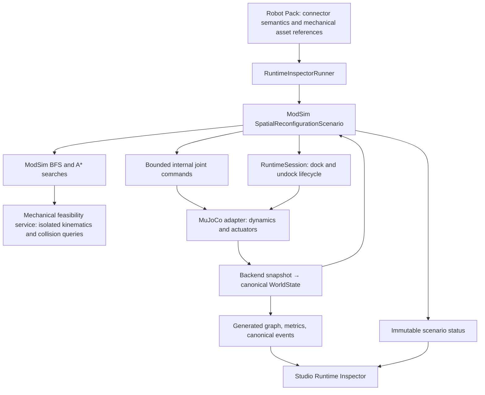

# The implemented SMORES 3D algorithm

For a paper-style derivation with numbered equations, proofs, pseudocode and
measured plots, read the [technical manuscript](papers/smores_3d_reconfiguration.md)
or its [PDF](papers/smores_3d_reconfiguration.pdf). It separates implemented
guarantees from proposed mechanical certificates.

The current algorithm is **support-aware spatial handoff planning**: breadth-first
search (BFS) over connector states, A* over bounded joint configurations, and a
ModSim feedback controller that executes and verifies the result. It plans an
elevated assembly operation directly in joint space, without first unfolding
the target onto the floor.

This is an experimental composition of established search methods, not a new
proven general 3D reconfiguration algorithm. The five-module benchmark uses two
fixed bases, a supplied rendezvous, and ideal connector welds. It demonstrates
one physical support transfer under gravity. See the [research proposal](smores_spatial_planning.md)
for prior work, the more general formulation, physical parameters, and limits.

## Relationship to the previous SMORES work

Liu and colleagues' [parallel self-assembly framework](https://arxiv.org/html/2104.00800)
unfolds suitable tree configurations into planar arrangements, assigns modules,
and coordinates assembly. Our experiment instead represents the current
attachments and searches joint motion while those attachments remain active.
Its key discrete operation is to acquire a new support before releasing the
old one. These are different planning assumptions; this experiment does not
establish broader reachability than the published framework.

Liu and Yim's [manipulation planner](https://arxiv.org/html/2104.02755v2) uses
constrained quadratic programming for joint motion. We have **not** implemented
that solver: our small benchmark uses sampled joint-space A*. An IK/QP solver
could later supply candidate motions inside the same support-mode framework.

## Inputs, target, and supplied choices

There are five modules: `helper`, `payload`, `receiver`, `arm`, and `upper`.
The helper and receiver bases are fixed to the environment. Initial attachments:

```text
helper/pan    ↔ payload/bottom
receiver/pan  ↔ arm/bottom
arm/pan      ↔ upper/bottom
```

The target keeps the two receiver bonds and replaces the helper–payload bond
with `upper/pan ↔ payload/left`. After capture, the receiving chain unfolds
into a vertical tower: `receiver → arm → upper → payload`. The helper parks
separately. Capture occurs about 0.151 m above the floor; the final top module's
center is about 0.331 m above it. A graph alone is not a 3D target:
the goal also specifies module positions and internal joint configuration.

| Supplied by the benchmark | Computed by the planner/controller |
| --- | --- |
| Module identities, helper, two fixtures, initial attachments | Supported order of connector changes |
| Target connector pair and rendezvous joint coordinates | Approach path avoiding sampled proxy collisions |
| Three moving joint coordinates and 15° discretization | Withdrawal path after changing support |
| Servo settings, tolerances, and time budget | Commands, measured docking acceptance, release, final outcome |

Fixture poses are calculated during staging from mechanical/connector frames.
They are not searched. Initial subassemblies are already assembled. Execution
never commands module root poses, root velocities, or external body wrenches.

## 1. Search connector states with BFS

A discrete state is a set of connector-labelled bonds, `E`. Anchors `A` identify
modules fixed to the environment. A state is admissible when:

1. Each connector appears in at most one bond.
2. Every module has a graph path through `E` to some anchor in `A`.

Neighbors add or remove one bond from `E_initial ∪ E_goal`. BFS gives a shortest
sequence of such changes, subject to a 4096-state budget. It does not invent
additional helper bonds. The result for this benchmark is:

```text
E_initial
  → add upper/pan ↔ payload/left       (capture; four bonds)
  → remove helper/pan ↔ payload/bottom (release; three bonds)
  = E_goal
```

Releasing first is rejected because the payload would have no fixture path.
This is a **graph support invariant**, not a calculation of load capacity,
friction, static equilibrium, or magnetic holding strength.

## 2. Search approach and withdrawal motion with A*

The approach coordinate is `u = (h, a, w)`, each integer from 0 to 6. Coordinates
map to joint angles as follows:

```text
helper tilt       = −h × 15°
arm tilt          =  a × 15°
payload left wheel = w × 15°
receiver tilt     = −90° (held throughout)
other joints      = 0°
```

Search goes from `(0,0,0)` to `(6,6,6)`. Each neighbor changes one coordinate by
one unit; edge cost is 1. The heuristic is Manhattan distance to the goal:
`H(u) = Σ |u_i − goal_i|`. It is admissible for this grid. There are at most
343 approach grid states; the returned path has 18 edges for the current pack.

A mechanical feasibility service evaluates scratch state, separate from live
simulation. It applies forward kinematics with the appropriate retained bonds,
checks joint bounds and inter-module/ground collision proxies, and applies a
coarse torque-budget screen. Each approach edge is checked at five subdivisions
(3° spacing), including its destination. Allowed proxy penetration is 0.5 mm.
There is no continuous collision certificate or equilibrium solver.

Withdrawal uses the **post-transfer** attachment mode. A second A* search moves
`(h,a,w)` from `(6,6,6)` to `(0,0,6)` on the same 343-state grid, sampling each
edge at 1°. The twelve-edge result keeps the payload wheel at 90°, first raises
the receiving chain slightly (`a=5`) for clearance, lowers the helper, then
straightens the arm to `a=0`. Direct helper withdrawal would intersect the
payload in the current collision model. Target positions are computed from
this final unfolded configuration, not the docking rendezvous.

The searches are sequential and performed before execution. If a motion query
fails, this executor reports failure; it does not backtrack into alternative
support modes, choose another helper, or generate a new docking pose.

## 3. Execute against measured ModSim state

The controller in `modsim.runtime.spatial` advances through:

```text
moving → transfer → retreat → verify → complete
   any active phase → failed / stopped / timeout
```

At each 1 ms physics step it slews joint targets at at most 0.35 rad/s and reads
joint position, velocity, and actuator effort from `WorldState`. The mechanical
service supplies contact diagnostics. Missing/nonfinite joint observations,
stale diagnostics, loss of a support path, excessive penetration, or stalled
tracking cause an explicit failure.

A waypoint settles when all commanded joints have position error below
0.018 rad and speed below 0.04 rad/s for at least 0.15 s. At the rendezvous:

1. Request docking through `RuntimeSession`, which runs ordinary ModSim
   connector compatibility, measured acceptance, and backend commit semantics.
2. Confirm the new bond exists in canonical `WorldState`.
3. Hold both attachments for at least 0.75 s, with settled feedback required.
4. Request helper release through the same lifecycle; confirm it committed.
5. Execute the unfolding/withdrawal path and hold the vertical target for at least 1 s.
6. Declare completion only with the exact goal bonds, settled joint feedback,
   and maximum receiving-assembly root-position error below 4 mm.

The docking policy is overridden to measured alignment **in memory for this
benchmark**; saved Robot Pack files are unchanged. A refused capture leaves the
helper attached. A refused release prevents withdrawal. Terminal states stop
physics stepping and remain available for inspection. The CLI exits nonzero
when execution ends without verified completion.

## Pseudocode

```text
stage the supplied initial assembly and fixtures
E = bonds in WorldState
mode_actions = BFS(E, goal_bonds, connector_exclusivity, anchor_reachability)
require this executor's capture-then-release structure
approach = AStar(start_joints, rendezvous, geometry(initial_mode))
withdrawal = AStar(rendezvous, parked_joints, geometry(goal_mode))

for each control step until terminal:
    slew bounded joint commands toward active waypoint
    RuntimeSession.step(dt) → backend snapshot → WorldState
    verify measured feedback, support paths, and contact diagnostics
    when the active waypoint has settled:
        advance waypoint, or
        request capture → verify commit → dwell → request release, or
        finish withdrawal → hold → verify goal → COMPLETE
    on invalid state, stall, stop request, or deadline: enter terminal state
```

## ModSim architecture



`modsim.planning.spatial` and `modsim.runtime.spatial` import no simulator,
NumPy, or GUI libraries. `SpatialMotionServices` is the narrow experimental
interface for feasibility queries, joint commands, and contact diagnostics.
MuJoCo is its first implementation. This does not yet introduce a general
actuator-command API for all ModSim backends; another engine would need to
implement these mechanical services and staging before running this benchmark.

The inspector and native viewer share **one** session. Qt receives immutable
graph/event/status frames, not live engine objects. The native view also shows
CAD with its original materials, committed bonds, fixed supports, and the
planned approach path. Target graphics appear in the inspector, with no
duplicate floating boxes in the native scene. The inspector shows actual bond
changes and canonical events, with controller phase, target error, and peak
effort. It uses the planar demo's shared Studio themes and layout: side-by-side
live/target topology in Runtime
state; projected spatial paths, action table, diagnostics, and categorical
action history in Planning; canonical events and planner decisions in Event
log. History zoom changes time only; the workspace offers 3D, front, side, and
top projections and preserves manual zoom during updates.

## Run and inspect

From an editable checkout with the `studio` and `mujoco` extras installed:

```bash
# ModSim Studio Runtime Inspector + synchronized native physics viewer
.venv/bin/modsim run examples/robot_packs/smores_ep \
  --demo smores_spatial_handoff --gui

# Same ModSim planner and controller, fully headless JSON report
.venv/bin/modsim run examples/robot_packs/smores_ep \
  --demo smores_spatial_handoff --output json
```

The default time budget is 45 simulated seconds. This benchmark always uses
gravity, ground, its five modules, and its fixed fixtures; generic count,
spacing, approach-speed, gravity, and ground options do not define its scene.
Connector overrides, height/orientation overrides, and scheduled undocking are
rejected. `--dt` must be an integer multiple of 1 ms up to 20 ms; internal physics
and feedback always use 1 ms steps. `--duration` changes the deadline.

Add `--no-viewer` with `--gui` for just the inspector, or use `--view` without
`--gui` for just the native viewer. The inspector’s Pause/Resume button and Space in the native window control the
same simulation; `S` or the inspector’s Stop button stops it. Completion freezes the scene and reports the verified outcome;
closing the inspector or pressing its Stop control shuts down the child.

The older `examples/scenarios/smores_spatial_handoff.py` entry point remains a
convenience wrapper for plan-only reports, custom torque limits, and slower
playback. It delegates execution to the same ModSim runtime controller.

## What remains research work

General 3D assembly needs joint search over helpers, docking poses, temporary
attachments, and continuous motion; calibrated actuator and connector loads;
contact/force feasibility; and recovery/replanning from observed deviations.
Parallel execution also requires combined load and swept-volume checks.
Neither a spatial final pose nor a successful fixed-base handoff proves that
a target cannot be assembled through planar unfolding. Those stronger claims
require additional task constraints, analysis, and benchmarks.
