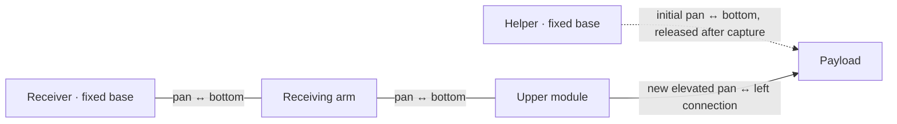

# SMORES spatial reconfiguration: proposal and first experiment

This is a research proposal plus a runnable, fixture-supported benchmark. It
does **not** establish a new general reconfiguration theorem or demonstrate
arbitrary free-standing 3D SMORES assembly. The implemented searches are
standard graph search methods; the proposed research contribution would be
their integration with mechanically verified support transitions for SMORES.
Novelty still requires a broader literature comparison and experimental study.

For an implementation-focused explanation, read [the algorithm and ModSim build](smores_3d_algorithm.md).

## What the previous work establishes

Liu, Whitzer, and Yim's **2019 distributed reconfiguration** work uses
connector-labelled configuration graphs, common-subconfiguration matching,
decomposition, and module correspondence to reduce connectivity changes.
Its distributed execution order proceeds from leaves toward roots. This is
useful for preserving existing subassemblies, but a connectivity sequence alone
does not establish a collision-free, gravity-feasible spatial trajectory.
See the [author manuscript](https://www.modlabupenn.org/wp-content/uploads/2019/08/chao_smores_reconfiguration_2019.pdf).

Liu, Lin, Kim, and Yim's **2020 parallel self-assembly** and expanded
**Autonomous Robots** paper consider tree targets that unfold into a plane
with distinct module locations. They choose a graph centre, unfold relative
poses, assign modules with a distance-based assignment problem, then assemble
by rooted depth with special handling around the root. Navigation, alignment,
and approach are separate control stages. A counterweighted helper already
lifts modules to orient their side connectors. Thus, lifting alone is not a
new extension. The conclusion explicitly identifies arbitrary 3D structures
and actuator limitations as future work.
See [Sections 4–7 of the expanded paper](https://arxiv.org/html/2104.00800)
and the [ModLab project and conference reference](https://www.modlabupenn.org/parallel-self-assembly-with-smores-ep/).

Liu and Yim's **manipulation planning** work provides another useful component:
configuration-dependent kinematics and sequential constrained quadratic
programs for joint motion, including joint and obstacle constraints. It is a
candidate motion solver inside an assembly planner, rather than a solution to
which connector to release or which component supports a lifted payload.
The current prototype uses sampled joint-space A* instead of implementing that
QP. See the [paper](https://arxiv.org/html/2104.02755v2).

Support-aware spatial reconfiguration also has substantial prior art outside
SMORES. For example, Wu et al. study quasi-static stability detection for
modular robots; Huang et al. present hierarchical assembly/reconfiguration
planning with torque and interface-force constraints for space robots.
These are relevant comparisons, not algorithms reproduced here.
See [Wu et al.](https://journals.sagepub.com/doi/10.1177/02783649241286491)
and [Huang et al.](https://doi.org/10.1016/j.robot.2025.105273).

## Proposed formulation

Use a hybrid state

```text
s = (G, X, q, qdot, C, H)
G: module graph with connector IDs and relative mate orientations
X: module root poses in SE(3)
q, qdot: internal joint positions and velocities
C: ground/environment contacts and any declared fixtures
H: reserved helpers and temporary support attachments
```

A goal needs both a connector graph and a spatial constraint set. A graph is
not intrinsically "3D": a tree can be drawn in a plane even when its physical
embedding is spatial. Likewise, an elevated final pose can sometimes be
obtained by planar assembly followed by joint motion. Those facts do not
demonstrate that the planar-unfolding restriction has been overcome.

For a stronger benchmark, require selected environmental contacts to remain
fixed throughout, and require docking at elevated locations. A possible later
target is a spatial frame connecting sockets on the floor and two perpendicular
walls. If four required fixed contact points have nonzero scalar triple
product, no configuration preserving those contacts can place all four points
in one plane. This is a simple geometric obstruction to flattening **under
those task constraints**, not a proof that an unanchored topology cannot unfold.
Whether a particular SMORES frame is reachable still needs port-level IK,
clearance, actuator, and connection-load checks.

### Support modes and action certificates

Search over support modes as well as target edges. Candidate primitives are:

- drive a supported module or subassembly on the floor;
- acquire a payload with a helper;
- lift, orient, and carry it through joint motion;
- dock at an elevated connector;
- transfer support, then release a redundant attachment;
- withdraw a helper or close a spatial loop.

A future mechanical certificate for each primitive must check all of:

1. **Kinematics:** joint bounds, reachable connector frames, mate orientation,
   and closure of every retained bond throughout the trajectory.
2. **Collision:** clearance of complete swept geometry, including the helper,
   receiver, and payload; allowed mating contact must be identified explicitly.
3. **Statics/dynamics:** support reactions, friction cones, actuator torque, and
   connector shear/normal/bending limits, with uncertainty margins.
4. **Handoff:** verify the new attachment and its load capacity before removing
   the old one, then verify the newly unsupported mechanism can withdraw.

For quasi-static planning, a feasibility subproblem could solve

```text
g(q) = S^T tau + J_c(q)^T lambda_c + J_e(q)^T lambda_e
|tau_j| <= derated torque_j
lambda_c in admissible contact/friction wrench sets
lambda_e in calibrated connector wrench sets
```

Here `g` is the gravity compensation vector, `S` selects actuated coordinates,
and the Jacobians map environment and connector reactions. Fixed fixtures can
react arbitrary wrenches in the current experiment; they must be replaced with
finite capacities for a hardware prediction. Dynamic planning additionally
requires inertia and velocity terms. A support polygon alone misses internal
connector overloads and is inadequate for many spatial assemblies.

### Conditional claims we can defend

**Support-path invariant.** If the initial connector graph connects every
module to a declared fixed support, and every accepted discrete transition
preserves that property and connector exclusivity, every accepted discrete
mode has those properties. Proof: induction over the accepted transitions.
This guarantees neither force capacity nor continuous-time stability.

**Conditional execution soundness.** If each action has a valid continuous
mechanical certificate, its entry conditions hold, transitions verify their
exit conditions, and execution stays inside the certificate's error bounds,
their concatenation satisfies those certificates. This is conditional
composition, not a proof that such actions exist for every target.

**Finite-search guarantees.** Breadth-first search is complete and shortest
over its finite supplied mode graph if its budget permits exhaustion. A* with
an admissible heuristic has the analogous guarantee over its supplied motion
grid. Neither result extends to continuous configuration space or to omitted
helper attachments. Sampled collision checks do not certify the intervals
between samples.

For parallel execution, rooted depth becomes a useful initial ordering rather
than a sufficient safety condition. Reserve moving bodies, connectors, helper
resources, and swept volumes; also check the **combined** load on shared
supports. Independent actions can then be scheduled together when the joint
certificate permits it. This scheduler and load solver are proposals, not
implemented features of this benchmark.

## Implemented target: elevated handoff into a vertical chain

Five SMORES-EP instances are used: `helper`, `payload`, `receiver`, `arm`, and
`upper`. Two root bodies (`helper`, `receiver`) are welded to the environment as
explicit test fixtures. The receiving subassembly starts upright; the helper
starts holding the payload horizontally. Preparation of these subassemblies
is an initial condition, not an autonomous assembly result.



The receiving chain folds toward the helper, accepts the payload, then unfolds
into a **four-module vertical tower**. The helper remains parked separately.
Approximate target root positions from the current CAD-derived pack are:

| Module | x (m) | y (m) | z (m) |
| --- | --- | --- | --- |
| receiver | 0.000000 | 0.000000 | 0.060000 |
| arm | 0.034458 | 0.000000 | 0.116416 |
| upper | 0.034458 | 0.000000 | 0.207289 |
| payload | 0.068916 | 0.000000 | 0.331471 |

URDF root origins are offset from the physical module centers. The midpoints
of the left/right wheel connector sites align vertically at `x ≈ 0.034458 m`.
Their heights are approximately 0.060, 0.151, 0.242, and 0.331 m.

The new docking faces meet approximately **0.151 m above the floor**. The
fixture placement is computed from the imported joint and connector frames,
not inserted as a runtime teleport. This is a demonstrator of elevated
reconfiguration and support transfer; we do **not** claim this tree is
intrinsically non-flattenable.

Implementation layers:

- `modsim.planning.spatial`: dependency-free support-mode BFS and bounded
  joint-grid A*. The support search generates capture-before-release because
  releasing first leaves the payload without a fixture path.
- `modsim.runtime.spatial`: owns both motion searches, command slew, measured
  joint feedback from `WorldState`, support-transfer decisions, and completion.
- `modsim_backend_mujoco.spatial_experiment`: supplies staging, scratch-data
  forward kinematics and collision queries, coordinate-to-joint mapping,
  motor commands, and contact diagnostics through `SpatialMotionServices`.
- Runtime execution: force-limited joint position servos, measured connector
  acceptance, ordinary `RuntimeSession` dock/undock commits, a transfer dwell,
  withdrawal, and a final hold. Root positions/velocities and body wrenches are
  never commanded during execution. Only initial staging sets root poses.
- `modsim_backend_mujoco.spatial_viewer`: native CAD rendering with measured
  topology lines, fixture markers, a planned approach path, legends, progress,
  and explicit terminal status. Original CAD materials are preserved; target
  geometry is shown in the Runtime Inspector rather than offset native boxes.

The approach grid has 15-degree increments and samples edges every 3 degrees.
Withdrawal edges are sampled every degree. The initial plan has 18 joint-grid
edges; the unfolding/withdrawal plan has 12. The latter first raises the
receiving chain slightly for clearance, then lowers the helper, then unfolds
the receiving arm into the vertical target. Direct helper withdrawal
intersects the payload in this model.

## Run it

Install the `mujoco` extra using the [README instructions](../README.md#install).
From the repository root:

```bash
.venv/bin/python examples/scenarios/smores_spatial_handoff.py --view --speed 0.5
```

The native viewer shows live CAD with its original materials. Cyan lines =
committed bonds; gold pads = fixed supports; white line = planned approach
path. Target topology and projected geometry are in the Runtime Inspector
when launched with `--gui` below. Space pauses, `S` stops, and closing the
window exits. The final state remains visible; add `--no-hold` to close it.
On macOS use the environment's `mjpython` for a native viewer.

Headless execution, or planning without advancing dynamics:

```bash
.venv/bin/python examples/scenarios/smores_spatial_handoff.py \
  --snapshot /tmp/smores-spatial-result.json
.venv/bin/python examples/scenarios/smores_spatial_handoff.py --plan-only
```

Both commands require MuJoCo because the geometric oracle uses the imported
physics model. The pure graph algorithms themselves require neither MuJoCo nor
NumPy. JSON distinguishes `planned`, `complete`, `failed`, `timeout`, and
`stopped`; only executed final topology, measured geometry, and a settled hold
produce `complete`. A failed run returns a nonzero exit code.

The same ModSim controller is available through the named Runtime Inspector
and CLI demo, with a default 45-second deadline:

```bash
.venv/bin/modsim run examples/robot_packs/smores_ep --demo smores_spatial_handoff --gui
.venv/bin/modsim run examples/robot_packs/smores_ep --demo smores_spatial_handoff --output json
```

The inspector shows the live topology, canonical event log, controller phase,
target error, and peak effort. The native companion shows the physical tower
and planned approach path. Both receive state from one authoritative session.

## Reference result and physical limits

A headless reference run completed in about **30.759 simulated seconds**
(roughly 62 seconds at half-speed playback, if the computer keeps up). Maximum
final root-position error was **0.57 mm**, peak proxy penetration was **3.32 mm**,
and peak actuator effort reached the **1.2 N·m** limit during transfer/unfolding.
These measurements describe one nominal simulation result, not hardware
performance or a robustness estimate.

The benchmark uses gravity, 1 ms solver steps, imported inertias and contact
proxies, 2 ms weld time constants, and the following provisional servo model:

| Parameter | Value |
| --- | --- |
| Position gain | 150 N·m/rad |
| Velocity gain | 0.6 N·m·s/rad |
| Effort limit | 1.2 N·m per joint |
| Reflected motor/gear inertia | 0.0005 kg·m² per joint |
| Command slew limit | 0.35 rad/s |

These parameters are simulation assumptions and are not calibrated SMORES-EP
ratings. The old URDF's 100 N·m placeholder is not used as the controller limit.
The planner applies a coarse `2 * module_mass * g * 0.10 m` torque-budget
screen for the helper lift; it does not bound the longer receiving chain's
load or certify static equilibrium. The longer chain requires stiffer servo
tracking than the earlier branch target to avoid sagging into the helper at
release. Measured effort, tracking, contact, and final-hold checks still apply;
the torque limit is unchanged. Connector ratings and magnetic attraction/breakaway
are not simulated. Collision meshes are
coarse face proxies and omit some hardware geometry. The planner permits up to
0.5 mm proxy penetration; runtime aborts above 4 mm. Those tolerances further
limit any collision-safety claim.

The bases are genuinely constrained to world by MuJoCo equalities; the gold
markers are visualizations of those assumptions. An anchored receiving
subassembly cannot demonstrate autonomous free-standing balance. Search is
bounded and performed before execution; the controller monitors live state
and fails on deviation, but does not implement general online replanning.

## Next research tests

1. Measure actuator curves and connector wrench limits; implement equilibrium
   feasibility and robust margins, then replace the fixtures with a wide base.
2. Search helper selection, temporary edges, docking poses, and continuous IK
   together, including useful recovery actions after a failed approach.
3. Build the floor/two-wall benchmark and spatial loop closure with exact
   connector orientations; test whether flattening is possible under its
   preserved-contact constraints.
4. Schedule independent lifts with shared-support load checks. Compare against
   depth-only scheduling and strictly sequential execution.
5. Evaluate success rate across mass, friction, pose, and torque perturbations,
   plus planning cost, makespan, minimum clearance, load margin, and recovery.
   A successful nominal animation cannot substitute for these measurements.

Tests cover the support invariant, connector exclusivity, intermediate
collision samples, bounded-search failure, low-torque refusal, no runtime root
control, capture-before-release, four vertically aligned module centers, settled completion,
and stop behavior.
